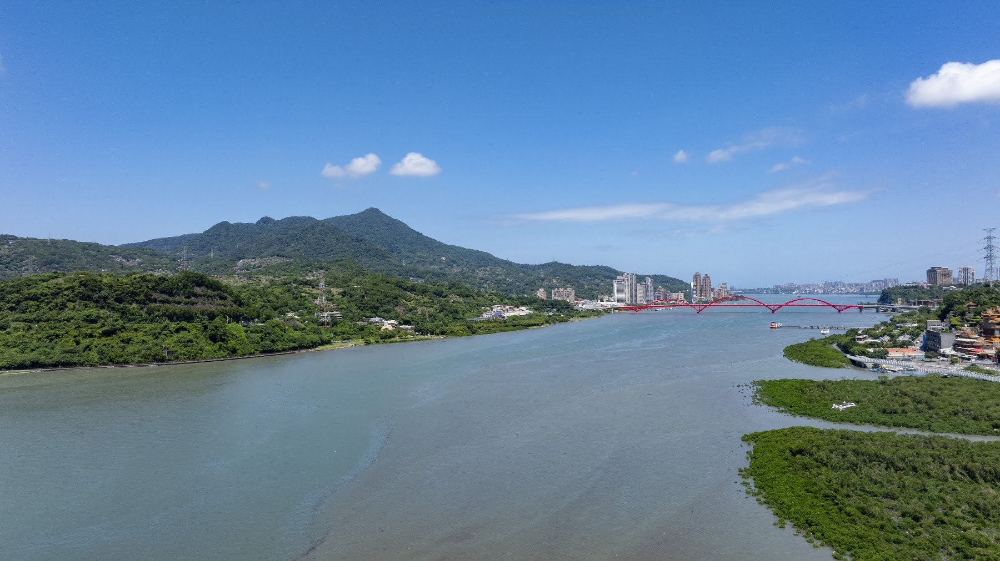
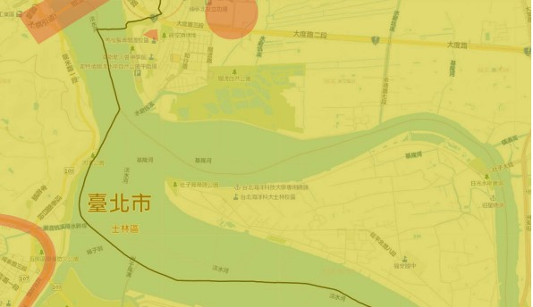
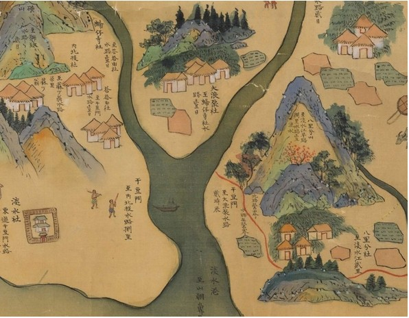

# 08.29 北投社｜兩河交會口，尋找消失的凱達格蘭

## 北投社空拍紀實

來到社子島頭，淡水河與基隆河在此相遇，對望關渡宮與「干豆門」歷史咽喉。鏡頭隨風升起，看著快艇在水面劃開白浪、水道穿過蘆葦草澤。紙上古地圖的線條，在眼前化作真實的山勢與水流，訴說著北投社人當年依水聚居、順流生活的起點。

影片：[08.29兩分鐘空拍](../assets/fieldwork-0829-120s-user-music.mp4)

## 鏡頭裡的現場：換一個高度，重新觀看

兩條河在島頭相遇，也把古地名帶回眼前

船隻停靠廟前，水路與岸上的日常彼此相依

一起走到河岸的夥伴，把共同的發現留在合影裡

兩側河水環抱島身，住屋沿著狹長的土地安頓

隔水望向關渡與遠山，古地圖有了眼前的參照

步道走到島頭，眼前是兩條河共同奔向的遠方

紅橋跨過寬闊河面，接起水岸兩邊的生活

關渡宮倚山面水，讓我們停下來細讀這片岸景

山腳的住屋與道路，收進同一片開闊的視野

水道穿過蘆葦草澤，讓人想起倚水而居的日子

橋下水流繞過洲地，在草木間分出細小的路徑

## 田野考察手記：把老師提出的問題，帶到眼前的土地

### 田野重點與拍攝核心

水文交匯與古地景：聚焦基隆河與淡水河交會口，對望關渡宮與「干豆門」歷史咽喉，對照河口地景的古今變遷。

凱達格蘭生活想像：結合河口濕地與蘆葦景觀，構思平埔族凱達格蘭社群昔日倚水而居、漁獵遊牧的生活情境，作為後續合成地圖與虛擬人物視覺化素材。

生態捕捉：涵蓋關渡水鳥保護區的動態生態影像，豐富在地田野資料庫。

### 行程規劃與延伸據點

第一站：社子島頭公園（集合點）。基隆河與淡水河匯流口、干豆門古地景、遠眺關渡宮、凱達格蘭生活想像虛擬場景素材。建議使用 DJI Mavic 3 Pro（空拍大景）、Insta360 X5（全景紀錄）。

第二站：社子大橋下。磺港溪匯入基隆河口之水文觀察與在地環境變遷紀錄。建議使用 Insta360 Luna Ultr、無線麥克風（現場收音）。

第三站：保德宮（備案）。地方信仰中心與社子島開發歷史脈絡走讀。建議使用手持口袋攝影機、全景鏡頭。

第四站：三層崎（備案）。獨特地形地貌與景觀視野之空間影像採集。建議使用空拍機與全景攝影機搭配延伸桿。

## 在地圖上讀回風景

