# 08.29 北投社｜兩條河相遇的地方

來到社子島頭，河風迎面而來。淡水河與基隆河在此交會，我們攤開古地圖，找到「干豆門」的位置，再抬頭望向對岸，關渡就在不遠處。

紙上的地名，第一次和腳下的土地產生了連結。

我們辨認山勢與水道，試著把幾百年前的地景，放回今天的視線裡。當空拍機離開地面，河道、沙洲和遠山從另一個角度展現出完整的輪廓。

也就在這個時候，一個問題浮現出來：

北投社的人，當年為什麼選擇在這裡生活？

也許答案並不複雜。
水，是生活的依靠，也是往來的方向。

站在兩條河交會的地方，我們看見的不只是地理位置，也開始理解一個聚落與土地之間最初的關係。

# 北投社田野與影像採集通告單

集合時間：2026年8月29日（六）上午9:00。

集合地點：台北市士林區社子島頭公園（導航地圖）涼亭內。周邊有廁所、飲水機、飲料自動販賣機。

## 田野重點與拍攝核心

水文交匯與古地景：聚焦基隆河與淡水河交會口，對望關渡宮與「干豆門」歷史咽喉，對照河口地景的古今變遷。

凱達格蘭生活想像：結合河口濕地與蘆葦景觀，構思平埔族凱達格蘭社群昔日倚水而居、漁獵遊牧的生活情境，作為後續合成地圖與虛擬人物視覺化素材。

生態捕捉：涵蓋關渡水鳥保護區的動態生態影像，豐富在地田野資料庫。

## 行程規劃與延伸據點

第一站：社子島頭公園（集合點）。基隆河與淡水河匯流口、干豆門古地景、遠眺關渡宮、凱達格蘭生活想像虛擬場景素材。建議使用 DJI Mavic 3 Pro（空拍大景）、Insta360 X5（全景紀錄）。

第二站：社子大橋下。磺港溪匯入基隆河口之水文觀察與在地環境變遷紀錄。建議使用 Insta360 Luna Ultr、無線麥克風（現場收音）。

第三站：保德宮（備案）。地方信仰中心與社子島開發歷史脈絡走讀。建議使用手持口袋攝影機、全景鏡頭。

第四站：三層崎（備案）。獨特地形地貌與景觀視野之空間影像採集。建議使用空拍機與全景攝影機搭配延伸桿。

## 裝備與物資分配

老師提供影音工具：DJI Mavic 3 Pro（含3顆電池）、Insta360 X5全景攝影機、Insta360 Luna Ultr口袋攝影機、延伸桿、無線麥克風等。

個人隨身攜帶：防護用品——帽子、太陽眼鏡（空拍操作需直視高亮度天空以維持可視度）、防曬乳、防蚊液。生理需求——足量飲用水、輕便衣物。

## 注意事項

夏季戶外高溫炎熱，請務必隨時補充水分，留意防曬與防中暑。

空拍作業時請注意高度保持60公尺以下，觀察周邊障礙物、天候、風向與氣候保護區規範，確實避免飛越人群、離建築物30公尺，確保飛行安全與視距可視程度。

自行車道往來車輛速度極快，避免在自行道上作業。

飛行者務必邀請同學協助觀測事宜。

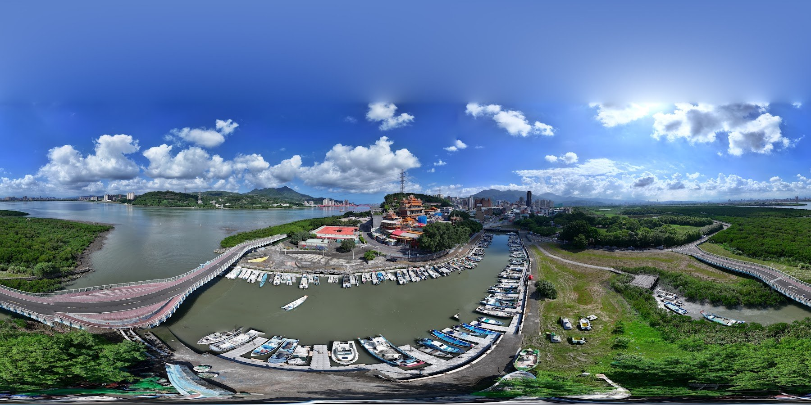

從河口上空望向水路與岸邊建築，地景在寬廣視野裡展開。

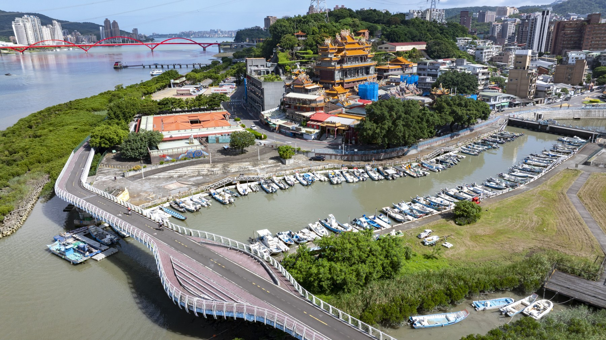

停泊的船隻、岸邊廟宇與城市，沿著水路層層相接。

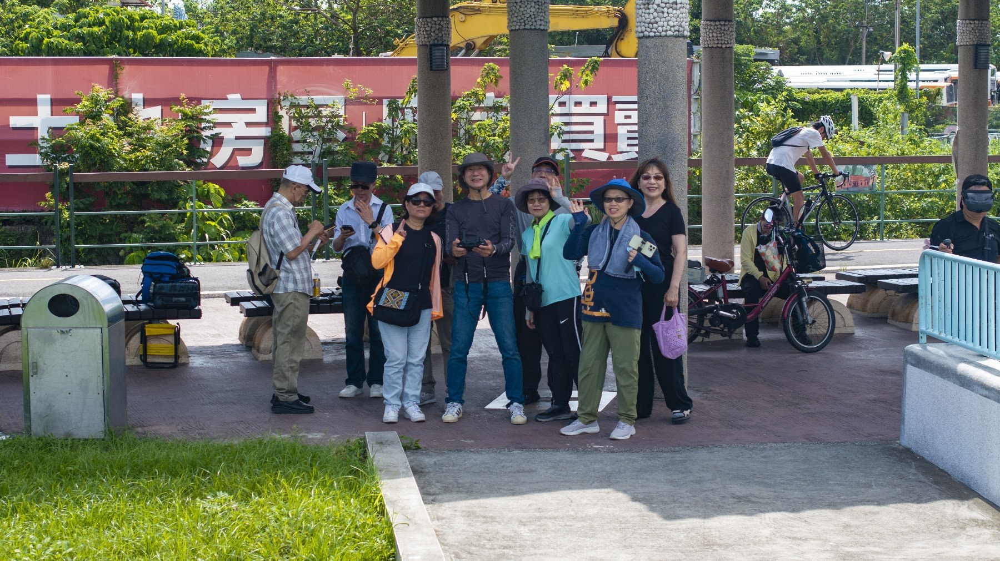

同行者在現場合影，留下這次走讀的共同記憶。

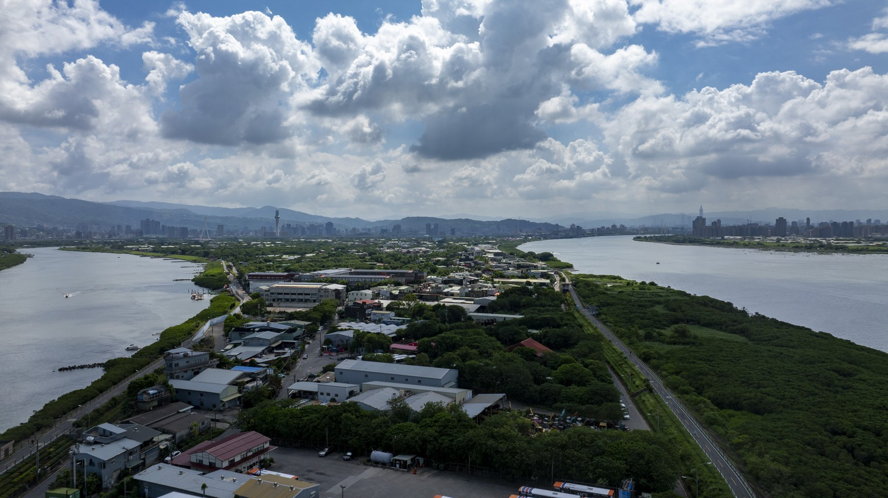

兩側水道包圍河岸土地，遠方的山勢在雲影下延伸。

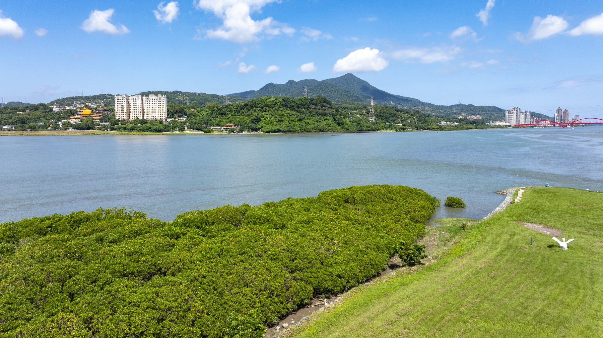

河面、岸邊綠帶與遠山，呈現地景不同的層次。

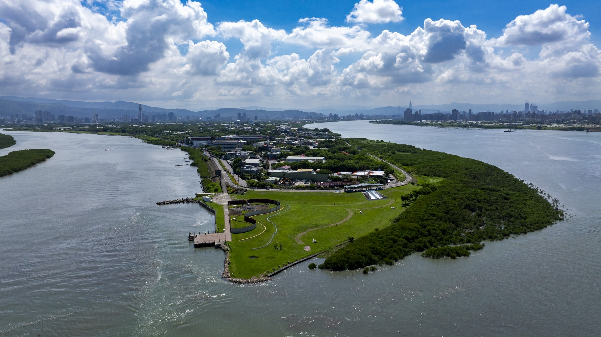

鏡頭望向島頭，步道與水岸的輪廓變得清楚。

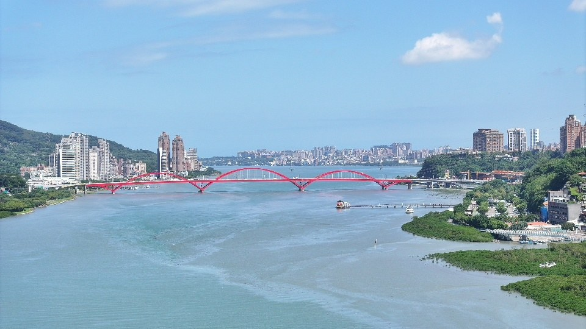

從空中看向彎曲的河道，兩岸建築與橋梁沿水路展開。

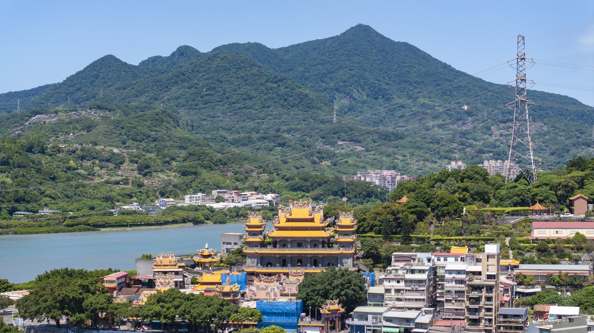

山腳下的廟宇與聚落，與眼前的水路相互對望。

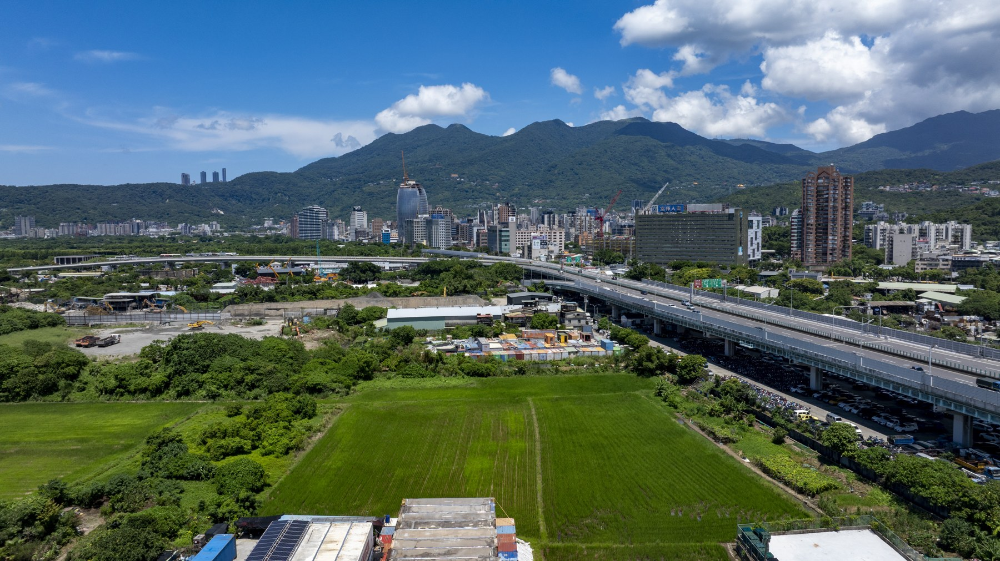

道路與城市向河邊延伸，空拍讓地形關係完整展開。

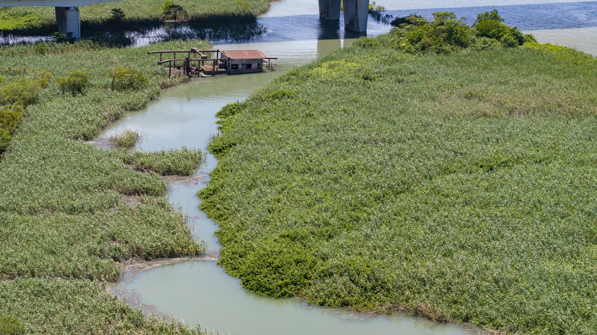

水道穿過河岸植被，空拍讓細小的地景關係變得清楚。

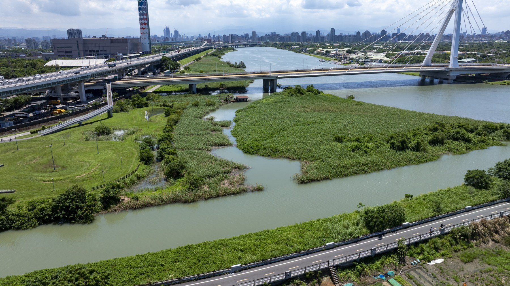

橋梁跨越水路與綠地，河岸濕地在城市邊緣展開。

## 北投社空拍紀實

拍攝地點｜淡水河與基隆河交會處、社子島及周邊河岸

影片：[08.29兩分鐘空拍](../assets/fieldwork-0829-120s-user-music.mp4)
