# 09.03 淡水與八里｜一片水，兩岸生活

河口的風帶著海的氣息。

淡水與八里隔著河相望，如今淡江大橋橫跨其間，讓兩岸的往來變得便利。只是站在水岸時，我們仍不免想到：橋出現以前，人們又是如何渡過這段水路？

這一天，我們在觀海路尾進行空拍。

附近屬於管制空域，飛行前必須仔細確認範圍；起飛之後，也只能朝河面方向前進。有限的飛行路線，反而讓我們更專注於兩岸之間的水域。

結束飛行後，我們前往八里十三行一帶走讀。

高處看到的是開闊的河口，走進遺址與展場，視線則落在一件件細小的遺物上。從遼闊的地景，到留下生活痕跡的物件，時間忽然有了不同的尺度。

原來，一條河的兩岸，不只是空間上的分隔。

渡河、往來與交流，也讓水面成為連結生活的一條路。

# 淡水社與八里社田野調查空拍與影像採集通告單

南港社大—消失的台北原住民故事班。

## 活動資訊與集合地點

採集日期：2026年9月3日（星期四）09:00集合。

集合地點：淡水漁人碼頭入口堤防（Google地圖連結），請看附圖位置。

個人必備裝備：攝影器材、防曬帽、飲用水、防曬／防蚊用品、太陽眼鏡（空拍直視高亮度天空時可維持視野清晰與眼部防護）。

移動方式：定點集結後，空拍創作者與地面拍攝需同時進行，地面移動結合 Ubike 騎乘移動，以靈活穿梭於河岸步道、老街巷弄及自然保護區周邊。

當天確認是否前往八里。若需要前進八里，暫定11:10新北考古公園集合地點。

## 器材清單

空拍設備：DJI Mavic 3 Pro（含電池3顆、控制器）。全景攝影：Insta360 X5（全景相機）、高角度延伸桿。口袋攝影：Insta360 Luna Ultra（口袋隨身相機）。單眼相機：Sony A7C+28-75鏡頭。收音設備：無線麥克風組。器材由老師提供。

## 拍攝重點與鏡頭設計

本計畫旨在透過影像重建凱達格蘭社群（淡水社、八里社、北投社遷居路線）的歷史生活空間想像，並提供後製合成地圖與虛擬人物疊加之素材。

淡水河口意象與淡江大橋。空拍：三鏡頭切換（24mm廣角呈現河口宏觀氣勢、70mm／166mm中長焦壓縮淡江大橋與河口對岸八里觀音山的空間關聯）。地採：利用 Insta360 X5 搭延伸桿進行低角度航行鏡頭（模擬船隻運河視角），提供後製疊加古航道地圖或虛擬帆船之基底。

淡水社生活區域與老街（建議非上課時間加拍鼻頭街／捷運站河岸）。地面拍攝與 Ubike：騎乘 Ubike 進行移動式第一人稱視角（FPV）鏡頭，記錄舊時聚落與現代河岸交錯的空間感；走訪鼻頭街捕捉傳統聚落紋理與地形起伏。

八里挖子尾（建議非上課時間加拍北投社遷居處）與十三行、大坌坑遺址。空拍：俯瞰紅樹林濕地與古河道交會處，捕捉「水陸交界聚落」的生存環境。360全景：於遺址與濕地節點設立 Insta360 X5 全景站點，後製可進行720度空間還原，並疊加凱達格蘭族傳統家屋與生活圖像。

## 空拍紅區限制與作業注意事項

淡水與八里沿岸部分區域臨近機場管制區延伸段、軍營、特定自然保護區或港區，屬於紅區（禁止飛行）或黃區（限高），請全體人員嚴格遵守以下守則。

起飛前合規確認：使用無人機管理資訊系統或官方 App DroneMap 實地確認當前坐標之空域分級與限高規範。紅區內絕對禁止起飛、穿越。

黃／綠區邊界作業：若於合法空域邊緣作業，嚴禁切入紅區範圍；拉高飛行時注意60公尺限高、120公尺絕對限高。

視線內飛行（VLOS）：必須保持目視飛行，並由一名組員擔任「空拍觀察員」，專注監視周邊鳥類（如河口鷺鷥群）、避開電線與高架建物。

安全應變：強風或突發狀況時立即切換返航；避開人群密集上方飛行。

## 多元影像採集技術與田野重點

三鏡頭高空／中空視角。設備應用：DJI Mavic 3 Pro。捕捉淡水河口大尺度地貌、淡江大橋橫跨兩岸的現代與古代地理對照，作為後製動態3D地圖疊加的主圖層。

Ubike 移動式流動鏡頭。設備應用：Insta360 Luna Ultra。騎乘於河岸自行車道與鼻頭街巷弄，拍攝連續性街景與在地生活氣息，創造具臨場感的田野行進視覺。

360度沉浸式環景。設備應用：Insta360 X5＋延伸桿。於挖子尾濕地、遺址現場進行定點或高空「假空拍（延伸桿）」採集，後製可任意重構鏡頭角度，並供 VR 視覺呈現。

現場環境音與口述收音。設備應用：無線麥克風。採集河岸風浪聲、濕地生態音及現場團隊對歷史地理的即時討論，為後續影片提供高品質聲景（Soundscape）。

## 集合地點與空域圖

預計空拍起降地點（觀海路尾），近鄰紅區，務必注意起飛後僅能往河中央飛，左右後面都是紅區。

八里空域圖，白色區域是主要飛行拍攝起降區域，11:10新北考古公園集合地點。

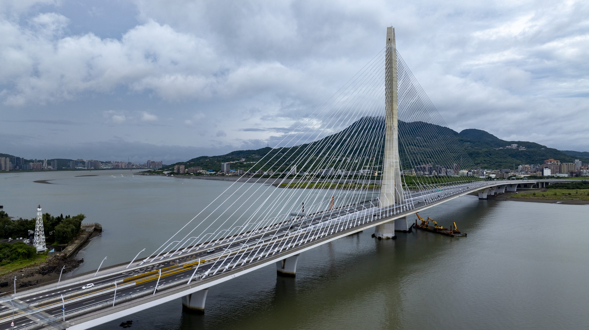

淡江大橋的橋塔與纜索，跨接眼前的河面。

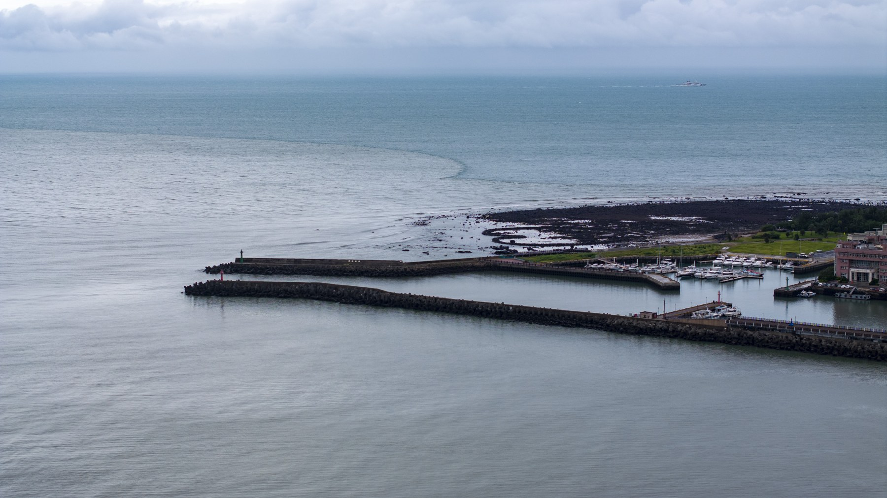

防波堤與港灣伸向水面，海岸線在遠處展開。

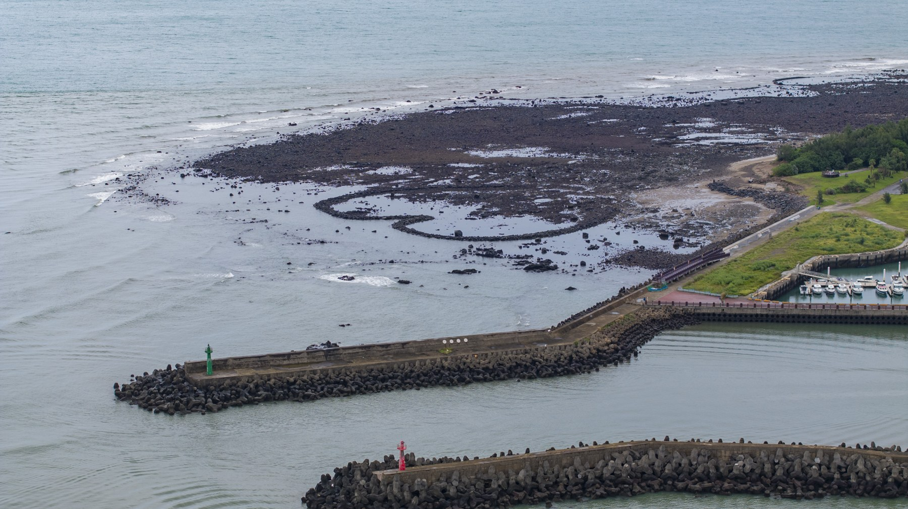

從防波堤上方觀看海岸，退潮後的石滬與岸線逐漸清楚。

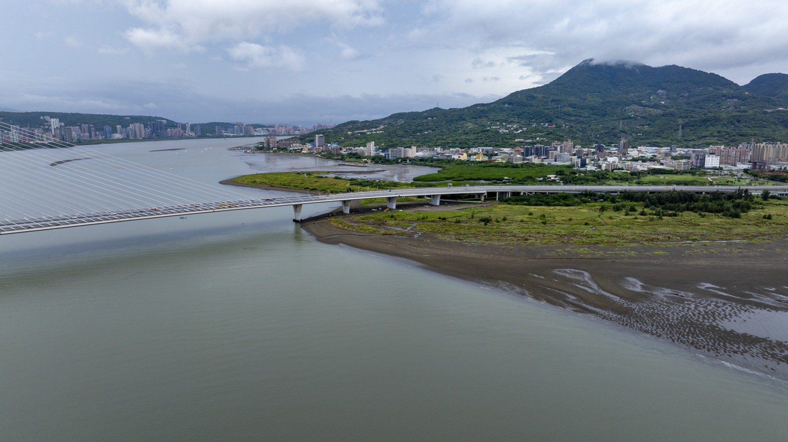

隔著河面望向橋梁與山勢，兩岸地景在同一個畫面相遇。

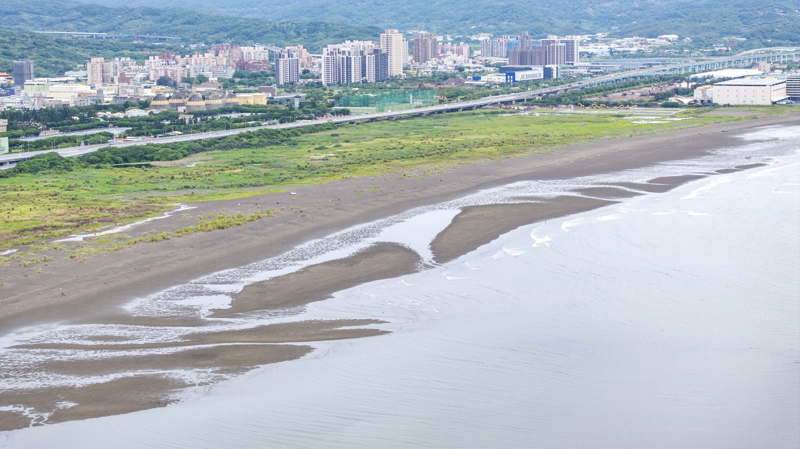

河岸灘地的紋理，留下水流與陸地交會的輪廓。

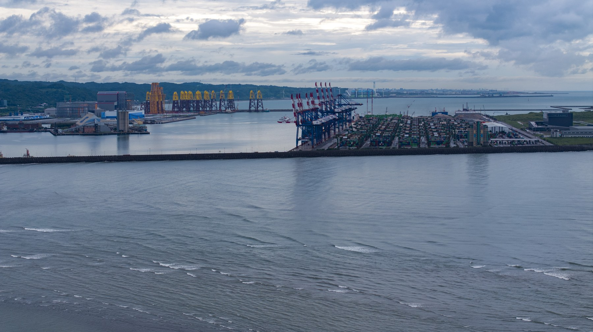

港區設施與河面並置，岸邊的不同使用方式逐漸清楚。

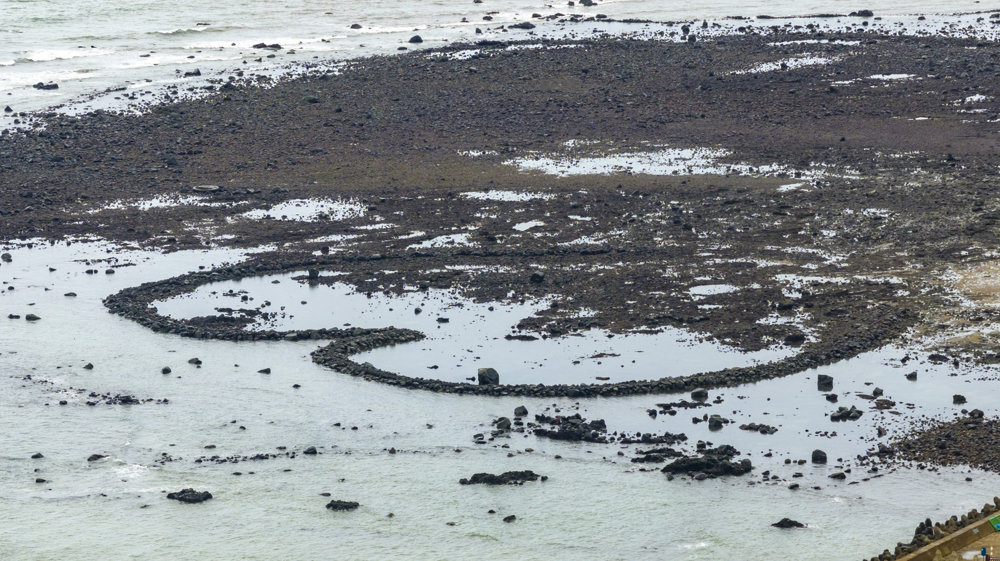

靠近海岸觀看，水面與礁石交錯出細小的地景紋理。

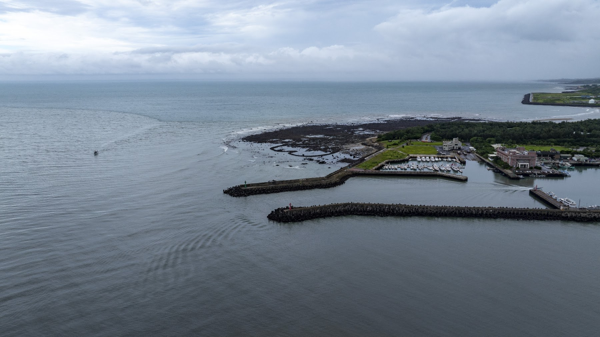

鏡頭轉向海岸，陸地與水域的交界成為另一條閱讀路徑。

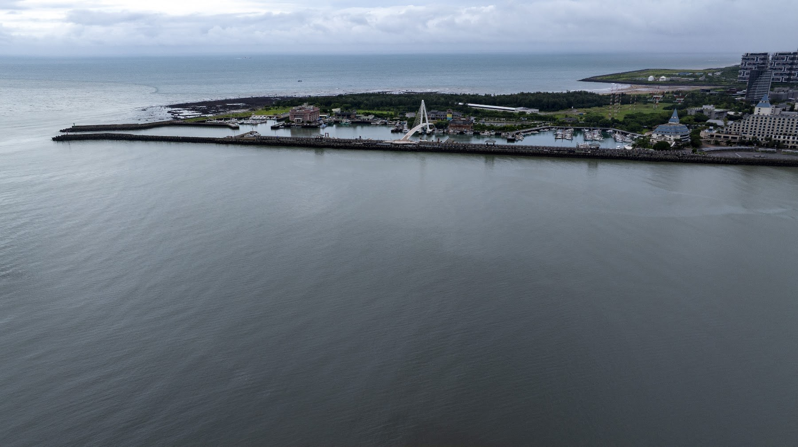

從河口上空看向港灣，海岸與聚落沿著水面展開。

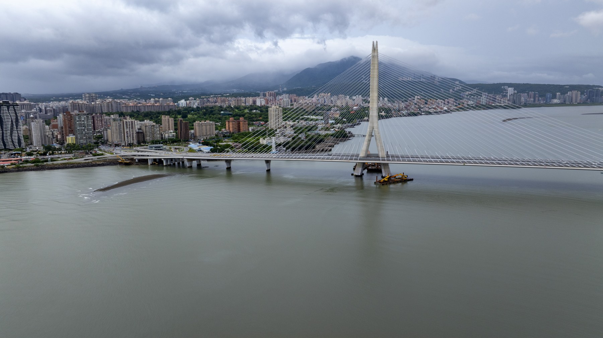

從另一側回望淡江大橋，橋塔、河面與對岸街廓相互映照。

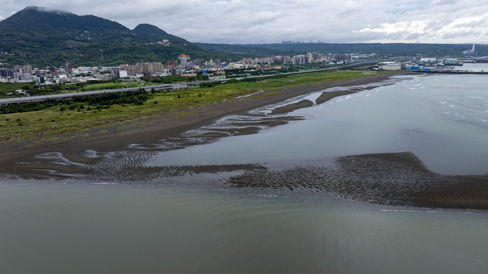

退潮後的河岸露出灘地，水路沿山城邊緣延伸。

## 淡水與八里空拍紀實

拍攝地點｜淡水河口、淡江大橋周邊

影片：[09.03兩分鐘空拍](../assets/fieldwork-0903-120s-user-music.mp4)

## 在十三行，讓看過的土地與展件相遇。

我們也把十三行博物館與歷史現場納入課程場域。十三行的展櫃裡，專注看著鎮館之寶的人面陶罐，反覆思索藝術美感在凱達格蘭人生活中的可能，那些被復原的生活情境模型，在走讀之後看起來完全不一樣了，學員不再是觀眾，而是帶著問題來對照答案的人。同一組展件，第一次看是知識，第二次看是證據。

遺址博物館館研析：走讀之後再回到展場，學員看的不是展示，而是自己問題的答案。
