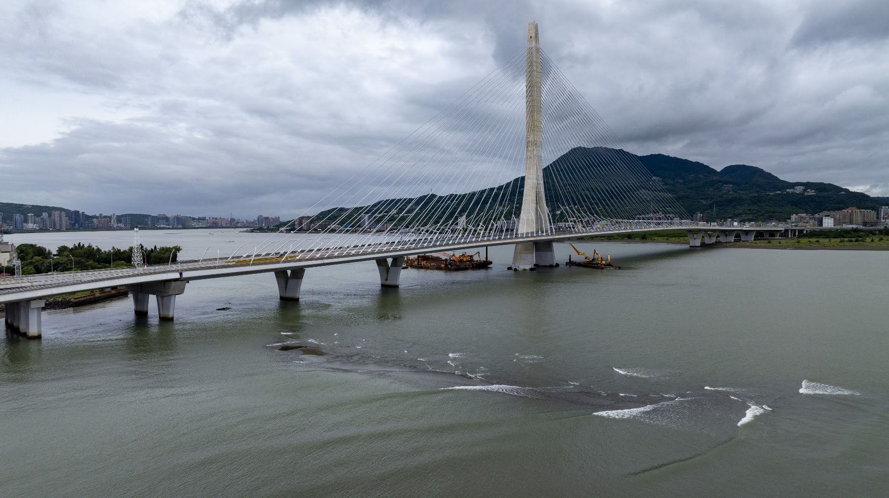
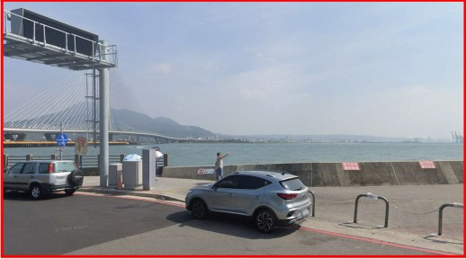
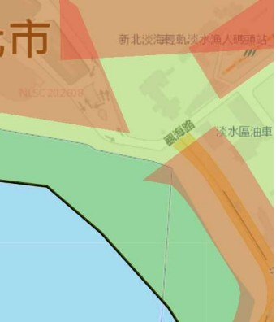
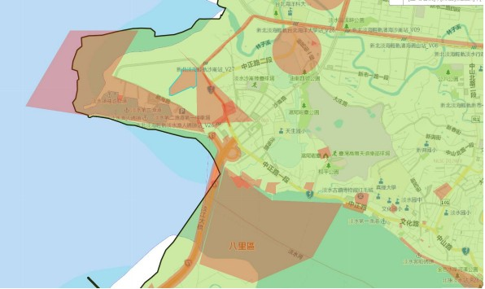
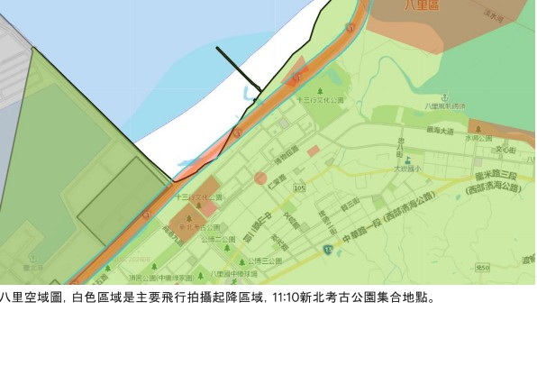

# 09.03 淡水與八里｜淡水河口空拍與十三行走讀

## 淡水與八里空拍紀實

拍攝地點｜淡水河口、淡江大橋周邊

飛越淡水河口，現代淡江大橋的宏偉鋼索正跨過昔日的渡船水路。鏡頭掠過市街與漁人碼頭，望向退潮時浮現的心型石滬與泥灘波紋。隔著寬闊的河面，大屯山與觀音山依舊對望，靜靜映照著數百年來人群跨河交流與出海航行的痕跡。

影片：[09.03兩分鐘空拍](../assets/fieldwork-0903-120s-trim18-v2.mp4)

## 鏡頭裡的現場：換一個高度，重新觀看

橋塔與纜索牽起兩岸，也留下昔日渡河的提問

防波堤伸向海面，河口的視野在此變得遼闊

岩礁與堤岸相鄰，海水描出陸地邊緣的曲折

隔著河面看橋與山，兩岸的距離有了具體模樣

水流在泥灘留下細紋，寫出河與岸相遇的形狀

對岸碼頭隔水可見，河口也承接著今日的往來

心型石滬在退潮時浮現出浪漫的愛心輪廓

沿著堤岸望向外海，想像舟船曾如何循水而行

港池在岸邊留出懷抱，容納船隻停泊與出發

纜索在水面上畫出斜線，身後是沿岸綿延的街屋

灘地依著山腳鋪開，留下水陸交會的寬闊餘地

## 田野考察手記：把老師提出的問題，帶到眼前的土地

### 拍攝重點與鏡頭設計

本計畫旨在透過影像重建凱達格蘭社群（淡水社、八里社、北投社遷居路線）的歷史生活空間想像，並提供後製合成地圖與虛擬人物疊加之素材。

淡水河口意象與淡江大橋。空拍：三鏡頭切換（24mm廣角呈現河口宏觀氣勢、70mm／166mm中長焦壓縮淡江大橋與河口對岸八里觀音山的空間關聯）。地採：利用 Insta360 X5 搭延伸桿進行低角度航行鏡頭（模擬船隻運河視角），提供後製疊加古航道地圖或虛擬帆船之基底。

淡水社生活區域與老街（建議非上課時間加拍鼻頭街／捷運站河岸）。地面拍攝與 Ubike：騎乘 Ubike 進行移動式第一人稱視角（FPV）鏡頭，記錄舊時聚落與現代河岸交錯的空間感；走訪鼻頭街捕捉傳統聚落紋理與地形起伏。

八里挖子尾（建議非上課時間加拍北投社遷居處）與十三行、大坌坑遺址。空拍：俯瞰紅樹林濕地與古河道交會處，捕捉「水陸交界聚落」的生存環境。360全景：於遺址與濕地節點設立 Insta360 X5 全景站點，後製可進行720度空間還原，並疊加凱達格蘭族傳統家屋與生活圖像。

### 多元影像採集技術與田野重點

三鏡頭高空／中空視角。設備應用：DJI Mavic 3 Pro。捕捉淡水河口大尺度地貌、淡江大橋橫跨兩岸的現代與古代地理對照，作為後製動態3D地圖疊加的主圖層。

Ubike 移動式流動鏡頭。設備應用：Insta360 Luna Ultra。騎乘於河岸自行車道與鼻頭街巷弄，拍攝連續性街景與在地生活氣息，創造具臨場感的田野行進視覺。

360度沉浸式環景。設備應用：Insta360 X5＋延伸桿。於挖子尾濕地、遺址現場進行定點或高空「假空拍（延伸桿）」採集，後製可任意重構鏡頭角度，並供 VR 視覺呈現。

現場環境音與口述收音。設備應用：無線麥克風。採集河岸風浪聲、濕地生態音及現場團隊對歷史地理的即時討論，為後續影片提供高品質聲景（Soundscape）。

## 在地圖上讀回風景

## 從地景，回到生活的線索：在十三行讓看過的土地與展件相遇

我們也把十三行博物館與歷史現場納入課程場域。十三行的展櫃裡，專注看著鎮館之寶的人面陶罐，反覆思索藝術美感在凱達格蘭人生活中的可能，那些被復原的生活情境模型，在走讀之後看起來完全不一樣了，學員不再是觀眾，而是帶著問題來對照答案的人。同一組展件，第一次看是知識，第二次看是證據。

