# 09.05 雞籠社與和平島｜站上社寮砲台，回望雞籠社的山海

## 雞籠社 和平島空拍紀實

拍攝地點｜和平島海岸、基隆港周邊

白浪一次次翻湧拍打深色岩壁，勾勒出和平島千疊敷的滄桑紋理。空拍機飛越橫跨八尺門水道的和平橋，俯瞰社寮砲台殘留的石砌碉堡，遠方孤懸著基隆嶼。在大航海時代的前哨，我們從浪花與岩岸的動勢中，聽見雞籠社曾歷經的風浪與記憶。

影片：[09.05兩分鐘空拍](../assets/fieldwork-0905-120s-recut-v2.mp4)

## 鏡頭裡的現場：換一個高度，重新觀看

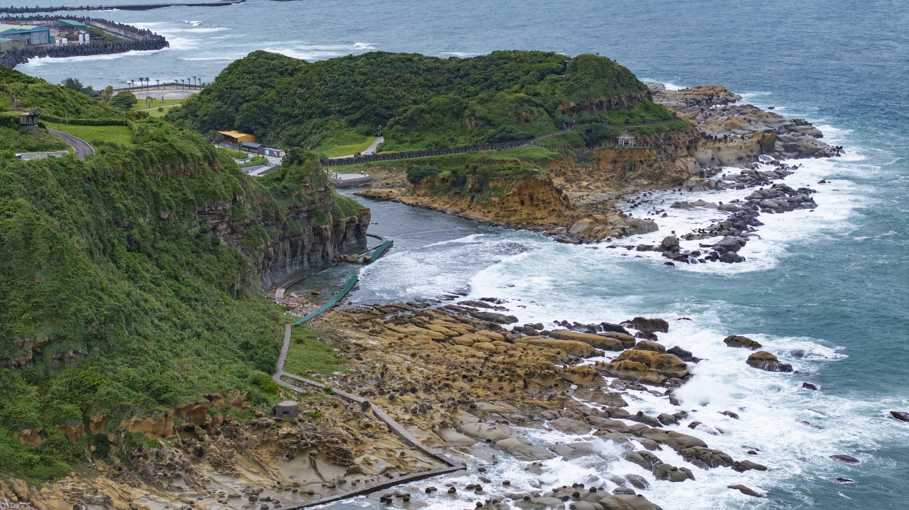

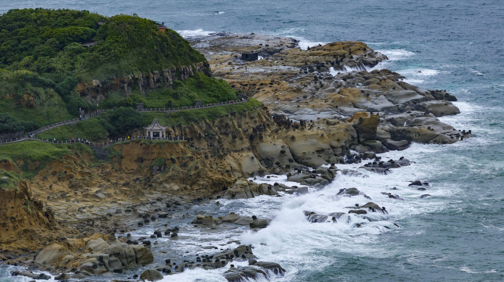
白浪沿著島緣翻湧，勾出和平島起伏的岩岸

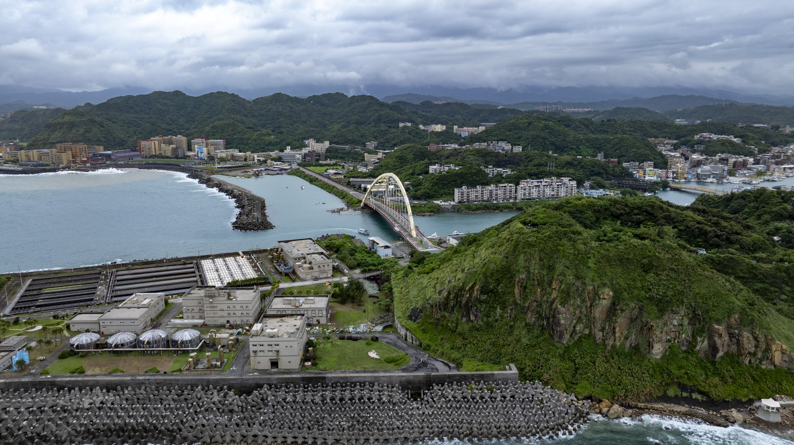
橋梁接起水道兩側，島上的生活有了往來的路

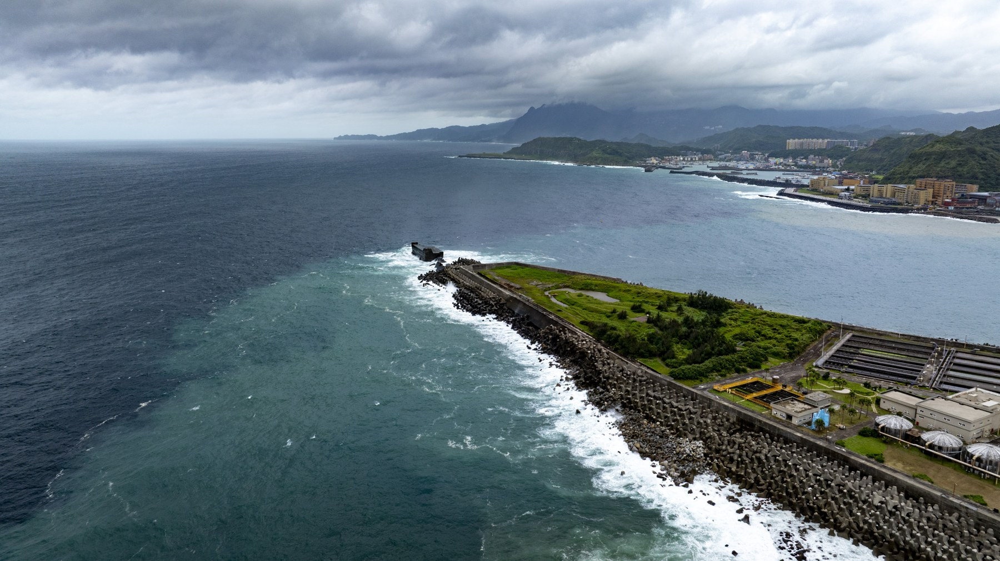
堤岸探向外海，遠方仍是一片無邊的水色

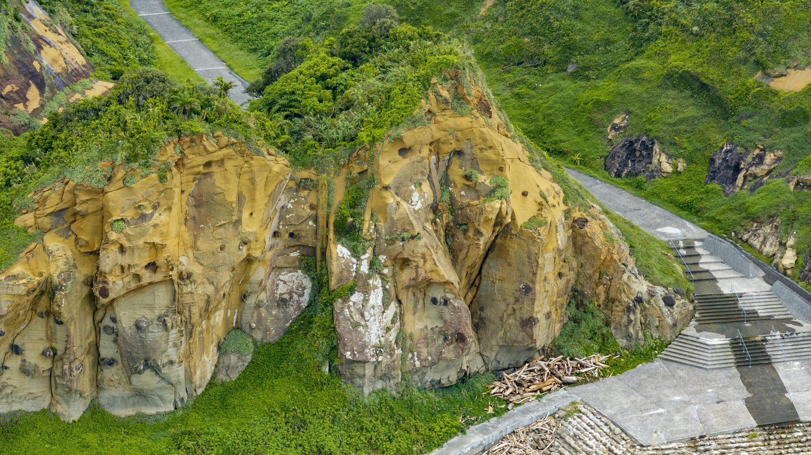
岩壁的裂隙與色澤，讓海岸有了可細讀的紋理

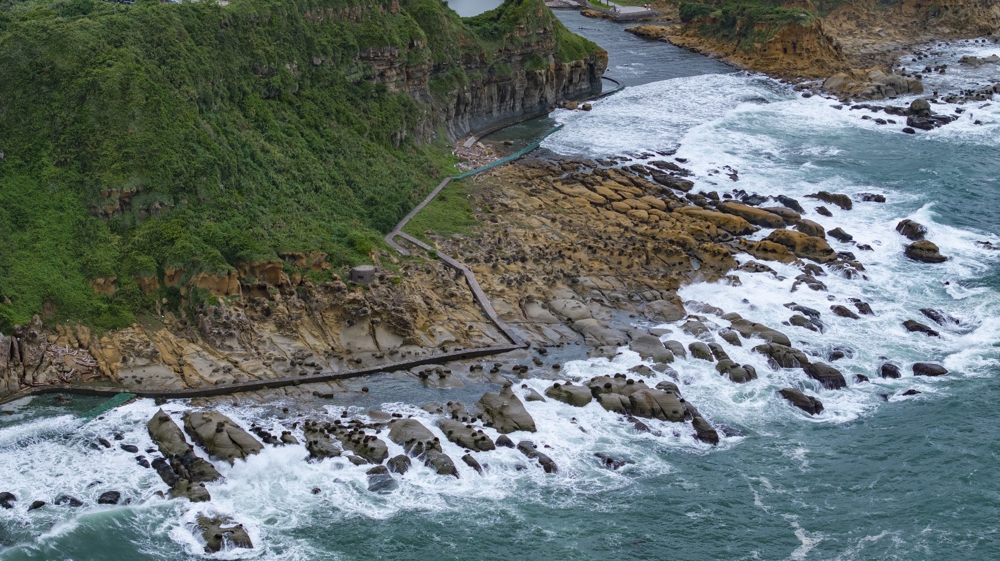
浪花一次次貼近岩壁，把海的動勢留在畫面裡

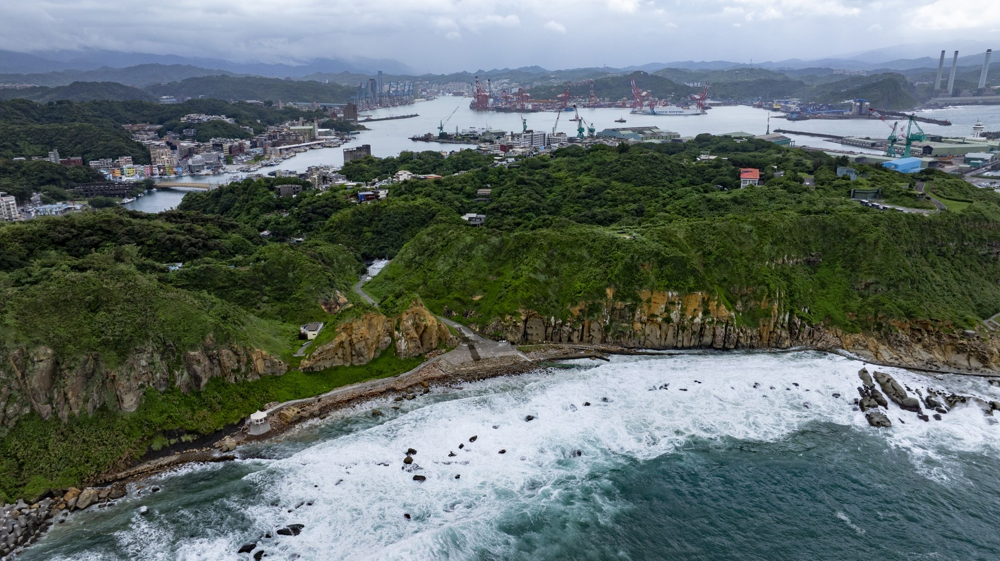
越過眼前的山坡，港灣在遠處慢慢露出輪廓

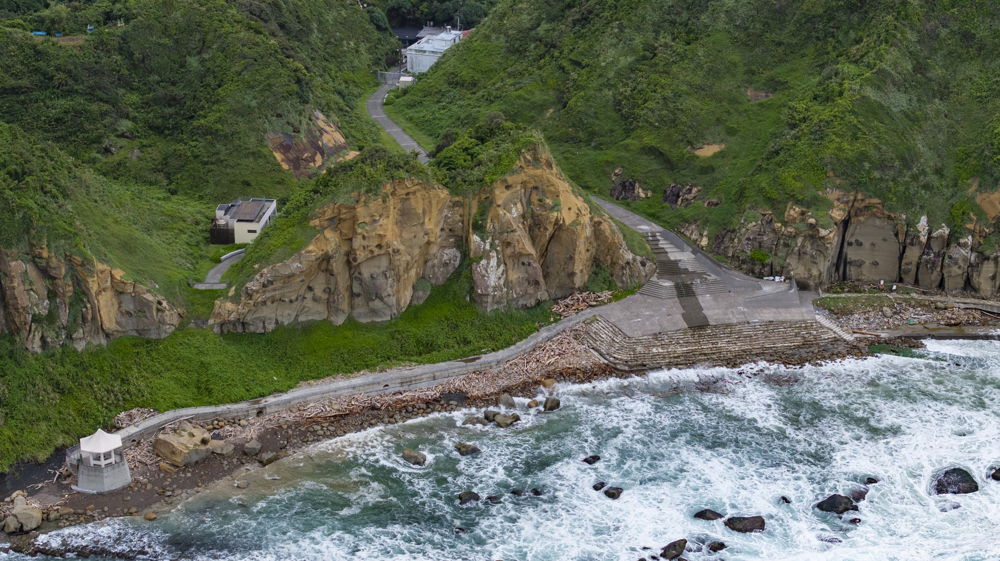
步道繞著草坡與岩塊，陪人走近海岸的轉折

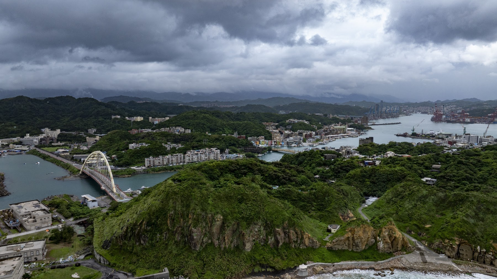
山丘、水道與港埠相鄰，雞籠社的故事從這裡追問

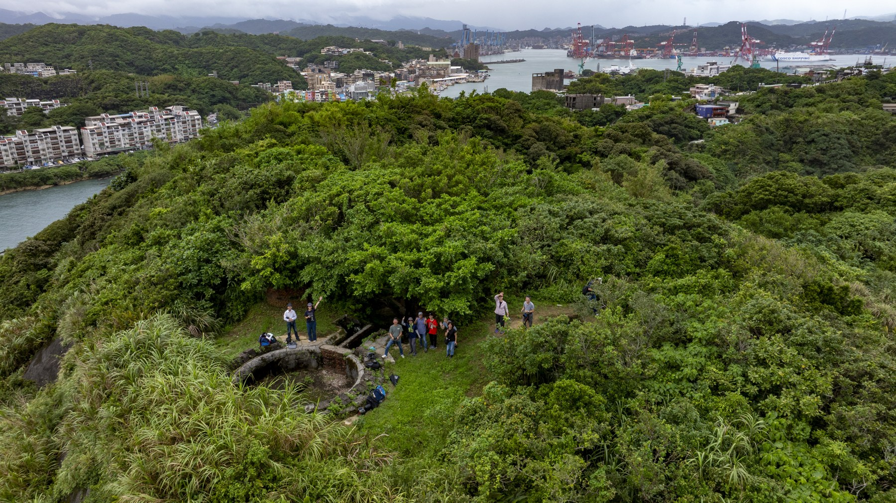
夥伴停在山坡上，把各自看見的山海交給鏡頭

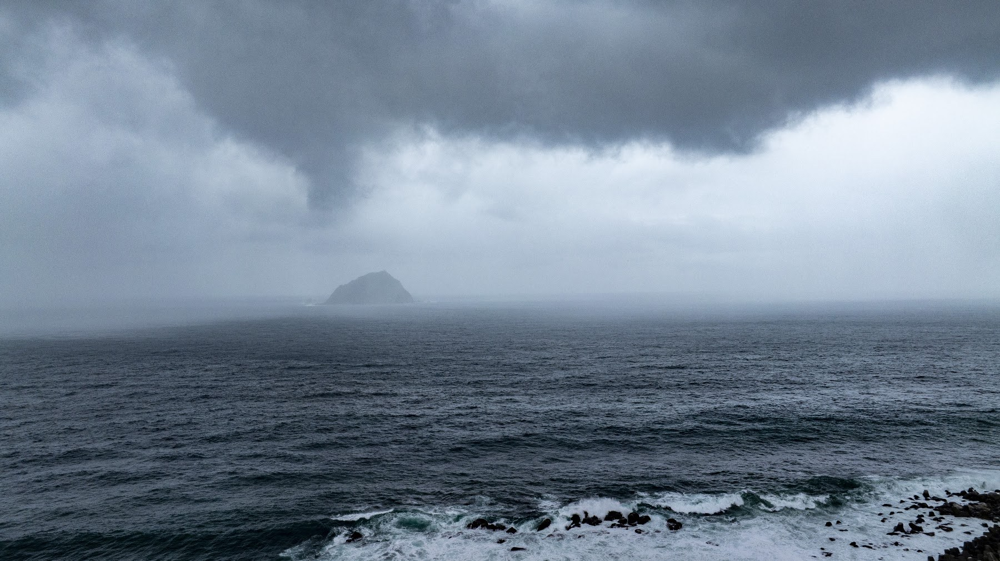
陰雲低低覆著海面，遠方島影在水天間隱現

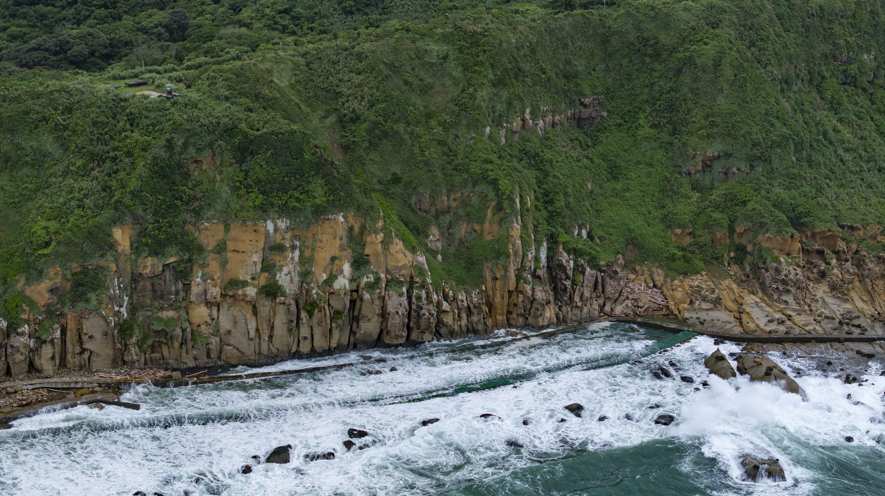
層層岩石迎著潮水，深色岸壁襯出雪白的浪痕

## 田野考察手記：把老師提出的問題，帶到眼前的土地

### 核心拍攝重點與多媒材影像延伸敘事

為後續歷史合成地圖（Map Compositing）與虛擬歷史人物／社群想像（Virtual Avatar / Spatial Visualizations）累積豐富的空間素材。

#### 雞籠社生活區域與社寮老街
空拍：正上方90度垂直正交俯瞰（Ortho-photo），記錄舊聚落紋理與當代建物疊合，做為歷史地圖合成底圖。
地面：使用 Insta360 X5 搭配延伸桿進行高低位穿梭，捕捉老街狹窄巷弄、老屋磚牆肌理與居民日常生活動線。

#### 八尺門海岸意象與和平橋
空拍：沿著水道進行低空平行運鏡，呈現八尺門水道的狹窄險要與和平橋連接社寮島與臺灣本島的陸連結構。
地面：於橋面及水岸邊拍攝潮汐流動與水面倒影，採集水流聲與船隻過往聲，建立原住民渡海與海岸生活場景。

#### 正濱漁港與彩色屋
空拍：遠距中景環繞，捕捉彩色建築與水面倒影的強烈色彩對比，結合基隆港遠景呈現新舊產業交替。
地面：口袋攝影機沿港區進行 POV 順滑移動拍攝，捕捉港邊漁獲作業、觀光人潮與當代漁業文化生活圈。

#### 基隆漁港景與海口想像
空拍：利用長焦鏡頭（Mavic 3 Pro 3x／7x）拉近基隆港大型郵輪、貨櫃碼頭與社寮島的空間關係，展現大航海時代門戶氣勢。
地面：於高處景觀台或海岸邊定點採集遠方港口汽笛聲與海浪聲，建立大航海時代西班牙／荷蘭船隻進港的視覺想像。

#### 阿拉寶灣與自然地質
空拍：遠距離拍攝蕈狀岩、豆腐岩等海蝕地景，呈現凱達格蘭族面對太平洋的原始自然生活環境樣貌。
地面：貼近岩石紋理進行微觀細節特寫，並利用360全景攝影機記錄天光變化與海浪拍打岩石的沉浸式視聽覺。

#### 西班牙聖薩爾瓦多城／教堂遺址
空拍：垂直正交與角度傾斜拍攝遺址周邊平面的相對位置，為後續 AR／3D 虛擬模型疊加提供精確地貌錨點。
地面：針對考古遺址現場進行360度環景掃描，搭配口述錄音，構建17世紀西班牙人與凱達格蘭族互動的空間幻影。

### 周邊延伸田野地點

#### 和平島地質公園
歷史與地景脈絡：社寮島北端海岸，擁有海蝕平台與豆腐岩等獨特地貌，為昔日族人面對太平洋之屏障。採集重點：360度全景記錄海岸地形、巨浪拍岸聲景及地質紋理，做為原始自然海岸地景之空間對照。

#### 社寮砲台
歷史與地景脈絡：位於社寮島最高處，掌控基隆港東側航道，見證清代至日治時期海防要塞演變。採集重點：俯瞰和平島全貌與八尺門水道，利用360攝影機架控營舍遺跡，重構軍事導致之視角。

#### 基隆燈塔
歷史與地景脈絡：西岸航道要衝，引導大航海時代以來進出基隆港之船舶。採集重點：長焦鏡頭遠距拍攝燈塔與西岸港口動線，對照社寮島東岸航道，構建港灣門戶整體意象。

#### 白米甕砲台
歷史與地景脈絡：基隆港西岸高地要塞，與東岸社寮砲台形成交叉火網，共同守護基隆港門戶。採集重點：遠距比較社寮島與基隆之對岸視野，採集西岸視野與海風聲景，作為東西兩岸防衛對照。

#### 外木山與外木山漁港
歷史與地景脈絡：基隆西北側天然海岸與傳統漁村聚落，保有豐富的海域開墾與海岸生活樣貌。採集重點：沿海岸線進行 POV 動態流動攝影，採集浪濤與漁港生活聲景，延伸海岸聚落空間感。

#### 八斗子海灣公園
歷史與地景脈絡：基隆港東側之陸連島地景，與社寮島遙相呼應，同為東岸門戶重要地理節點。採集重點：高空俯瞰八斗子海蝕平台與望幽谷地景，與和平島地質進行空間對比與歷史海域連結。

## 在地圖上讀回風景

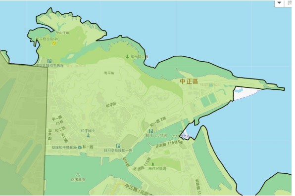
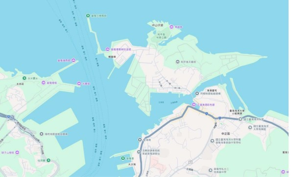
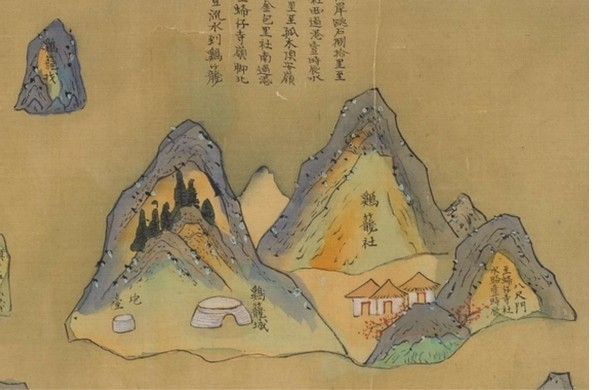
