# 09.10 基隆河流域｜沿著河，尋找三個社的土地記憶

## 基隆河流域空拍紀實

拍攝地點｜基隆河汐止段及周邊河岸

鋼桁架鐵橋與現代拱橋橫臥水上，基隆河在密集的現代樓房旁彎曲流淌。順著蜿蜒的水道緩緩推進，兩岸綠帶護著昔日的水返腳。當鏡頭收攏河灣沙洲與背後的重重遠山，這條滋養峰仔峙社的古老水路，正帶著我們逆流讀回台北盆地最初的記憶。

影片：[09.10兩分鐘空拍](../assets/fieldwork-0910-120s-river-ending-v3.mp4)

## 鏡頭裡的現場：換一個高度，重新觀看

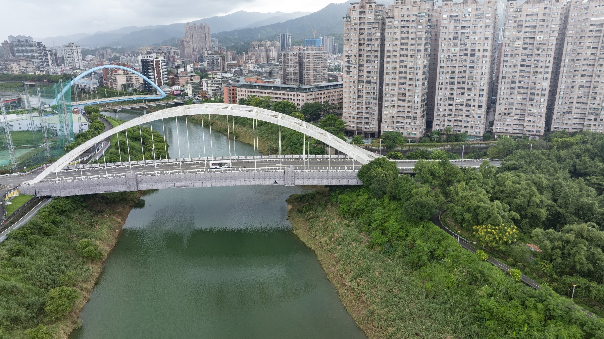

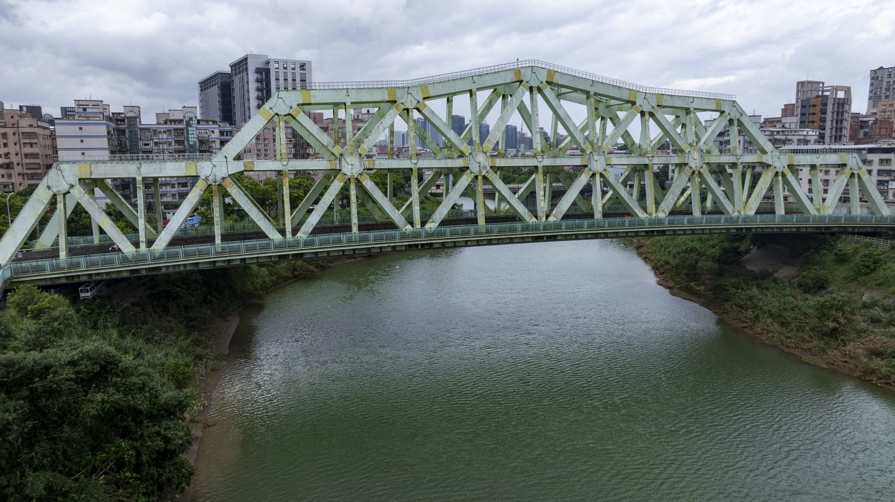
鋼桁橋橫過河面，接起兩岸日常往來的方向

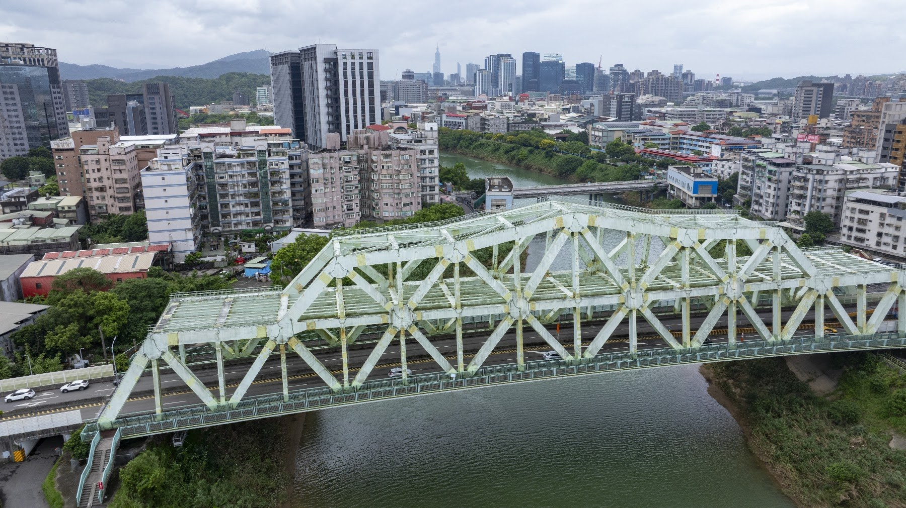
橋頭道路伸入街區，視線隨著屋舍轉向上游

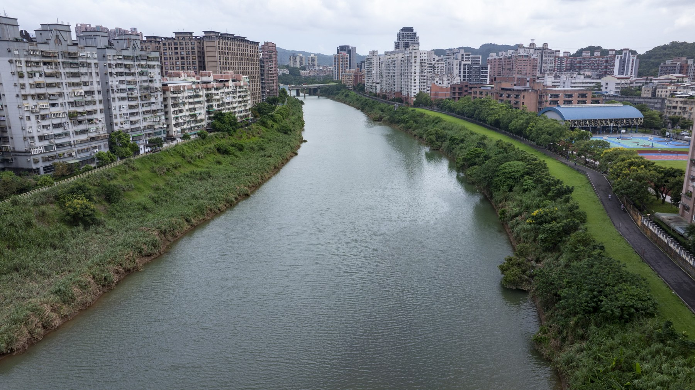
綠帶沿水邊延續，兩側住屋圍出河流穿行的廊道

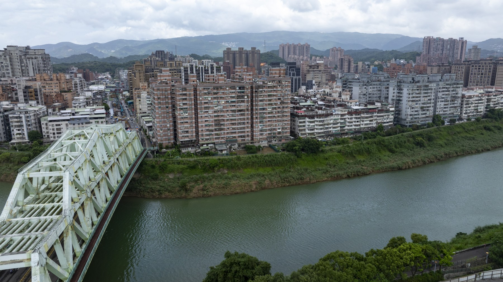
橋身斜入水岸，隔河的街屋與遠山一同入鏡

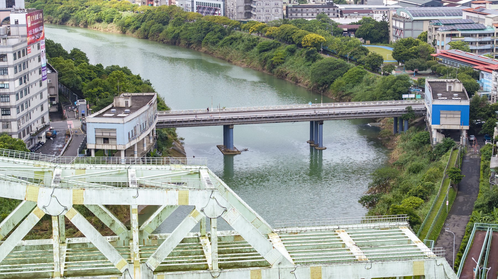
兩座橋在水上前後相望，帶出不同的渡河尺度

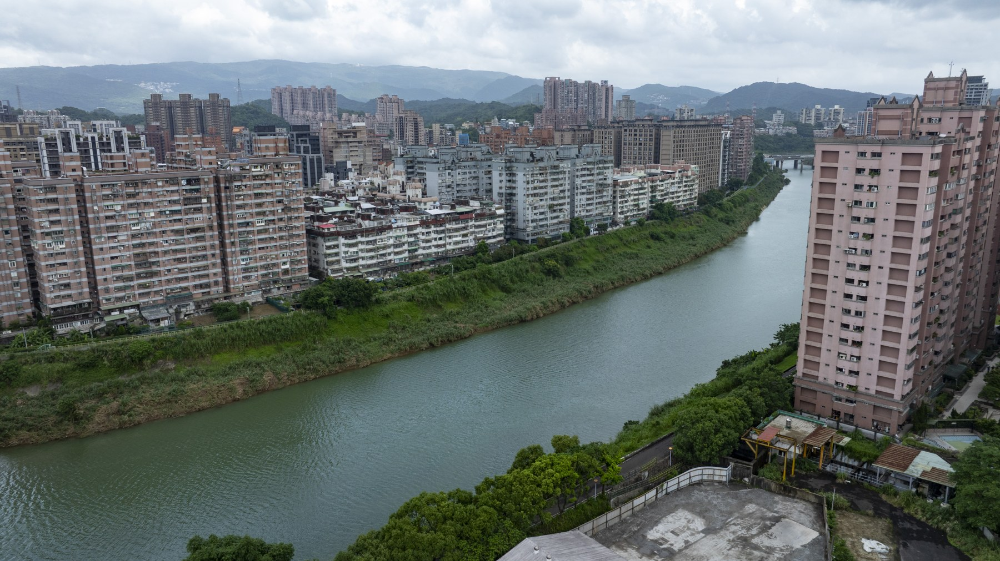
河道從樓房旁斜斜轉過，綠意沿著岸線延續

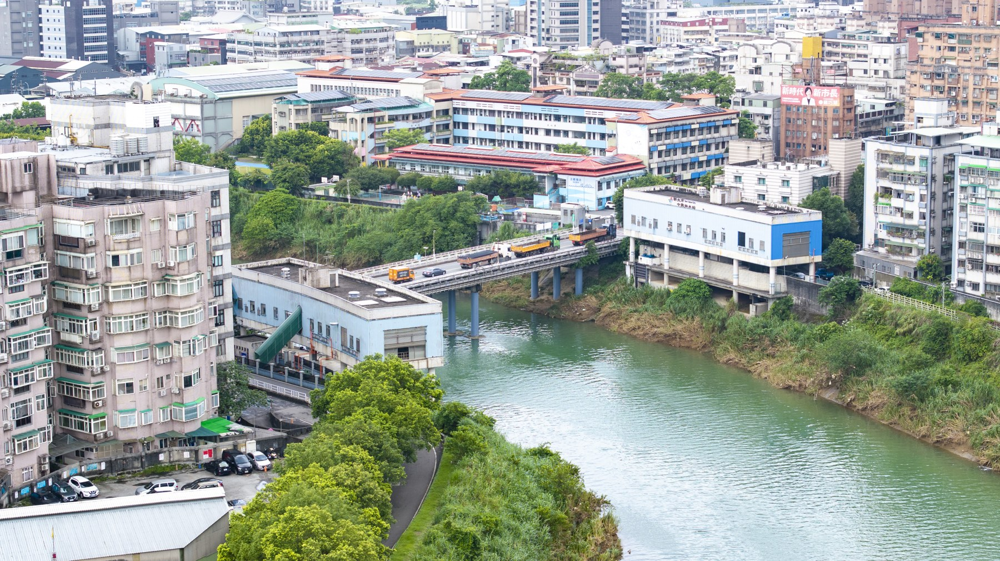
建物之間仍留著一條水路，引我們循河尋讀往事

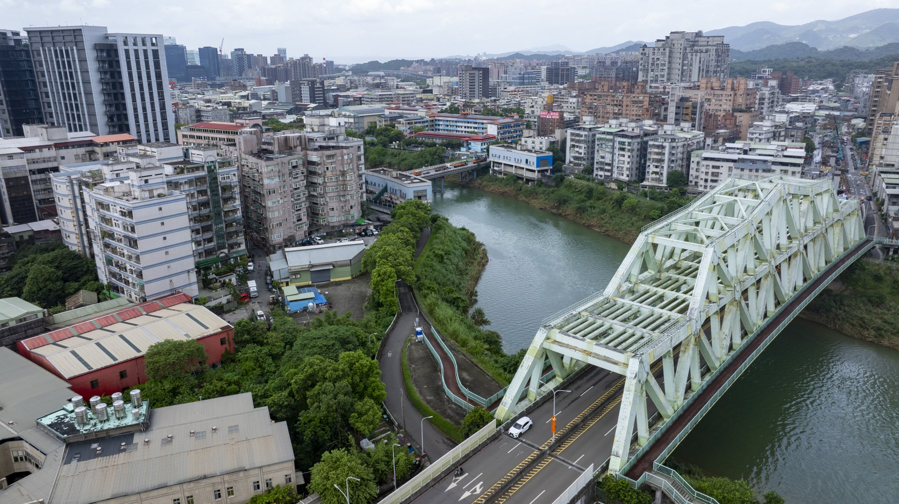
步道沿著橋端折返，把岸上的腳步接回河邊

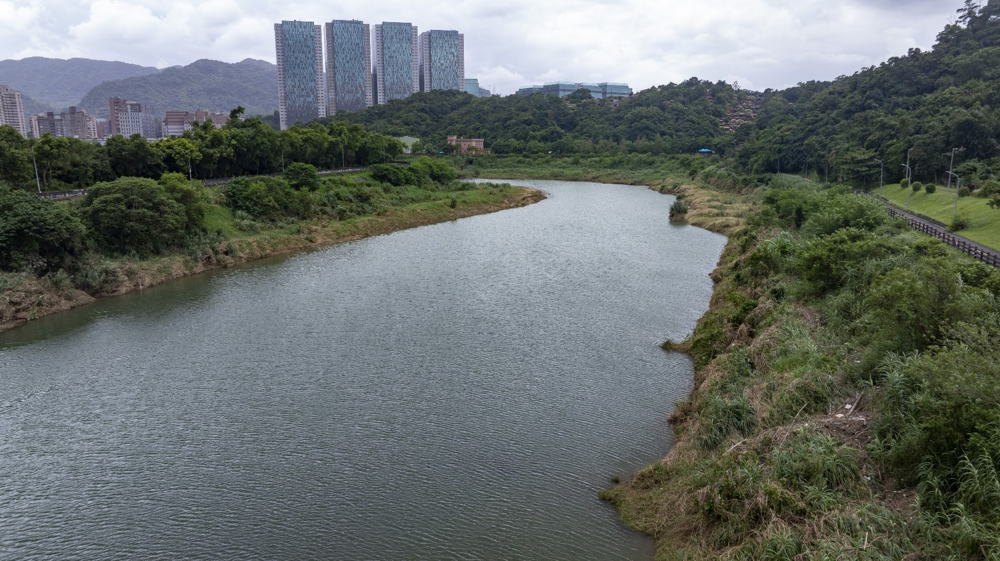
河灣舒展出彎曲的輪廓，等待與古地圖慢慢對照

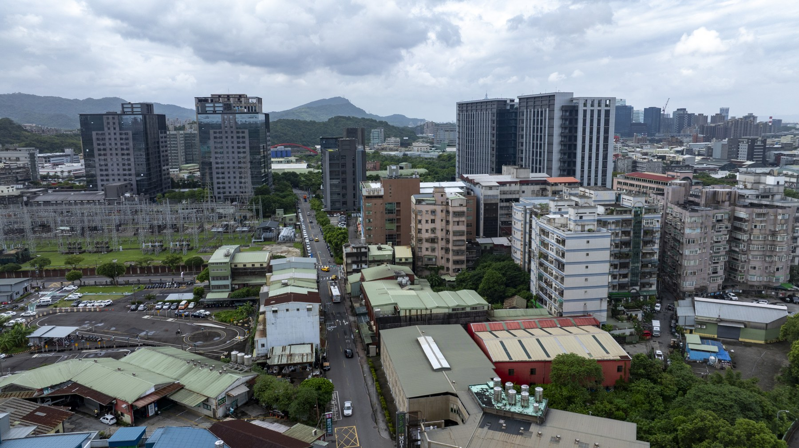
巷道穿過密集住屋，舊日的線索仍待逐一尋讀

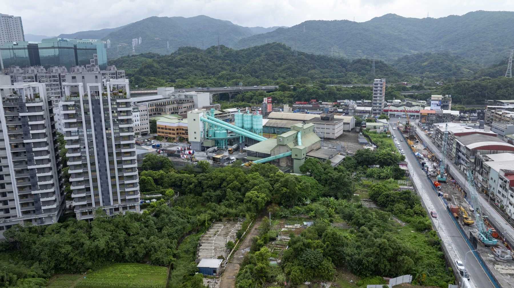
遠山守在樓房背後，讓沿河尋社有了更寬的視野

## 田野考察手記：把老師提出的問題，帶到眼前的土地

### 拍攝重點與延伸地點

基隆河岸汐止段與水尾灣園區：記錄河道演變與原住民族沿河墾殖、建聚之地形空間。

新社舊社橋與社後地區：探尋「峰仔峙社」歷史聚落核心，對比當代都市地景與昔日平埔族群社址。

原住民公園與小南港山：從小南港山高位俯瞰基隆河彎道與平原全景，建立峰仔峙社群生活空間的地理想像與空間軸線。

周邊延伸地點：社後頂（湖光里）、松山錫口社、塔塔悠社、樟樹灣周邊步道與聚落邊界。

### 影像採集技術 手法與拍攝可能性延伸

#### 空拍作業與視野拓展
空間想像構圖（古今疊合）：利用 DJI Mavic 3 Pro 的多焦段鏡頭（廣角、3x、7x中長焦），針對基隆河彎道（如水尾灣）、新社橋進行高空正俯瞰（Top-down）拍攝，方便後續製作古地圖與當代地景的疊合圖層。
以長焦鏡頭遠距壓縮感，拍攝小南港山與基隆河道的空間相對位置，帶出虛擬人物或古路徑在現代建築縫隙中的歷史想像。
一軸軌道航拍：沿著基隆河水岸進行低空一鏡到底（One-take）推進，模擬昔日舟楫航行於基隆河向東探尋峰仔峙社的視角。

#### 地面移動與機動採集
Ubike 騎行視角：團隊可善用基隆河自行車道，騎乘 Ubike 進行高效率移動採集。將 Insta360 Luna Ultra 或 Insta360 X5 固定於 Ubike 車把手、胸前或安全帽上，進行流暢的「沿河導覽動態紀錄」。
無線麥克風口述紀錄：騎行或步行停靠重點站點（如舊社橋、原住民公園）時，文史講解者配戴無線麥克風，結合地面中近景進行現場田野口述側拍。

#### 360度全景與高角度互動技術
超高視角（超長延伸桿應用）：將 Insta360 X5 安裝於高角度延伸桿上，於窄巷、舊社橋下或樹冠層中伸出，模擬「低空無人機」無法進入的穿透視角。
全景互動與虛擬疊合：利用360全景拍攝，後製可彈性選擇視角（小行星模式、平視鏡頭轉場），並利於在後製軟體中加入3D虛擬導覽標籤、古今邊界線或虛擬平埔族群人物插畫。

## 在地圖上讀回風景

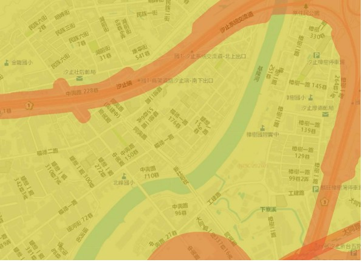
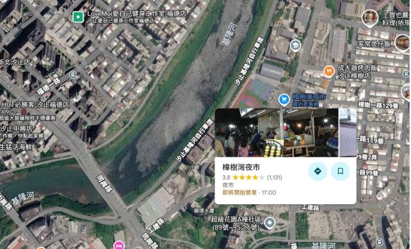
