# 華麗轉向：台北原民故事的知識共構教學實踐

——「消失的原民故事‧凱達格蘭社空拍創作工作坊」課程設計手記

南港社區大學 × 臺北市原住民族部落大學 民族學苑

世新大學廣播電視電影學系 副教授  何懷嵩

## 一、一座很會遺忘的城市

台北是座很會遺忘的城市。捷運從地底穿過，高架橋沿著河岸畫出弧線，人們在便利商店前等紅燈。很少有人意識到，腳下這片被水泥覆蓋的沖積平原，三、四百年前還是凱達格蘭族的生活場域的模樣。地名雖然都還在——北投、唭哩岸、錫口、關渡(干豆)、八里坌——只是說得出來歷的人愈來愈少。名字留了下來，故事卻走了。 南港社區大學與臺北市原住民族部落大學合作開設的這門工作坊，就是從這道落差開始的。課程核心理念是「飛越歷史，紀錄土地」；但作為課程設計者，我心裡想做的事其實更素樸：找一群背景完全不同的成年人，讓他們帶著各自的專業走進同一片地景，看看能一起長出什麼東西來。 社區大學的成人教育有一個常被低估的優勢——學員不是白紙。他們帶著各自的人生經驗進教室，這些經驗如果只被當成「學習背景」，就浪費了；如果被當成「教材」，整門課的層次就完全不一樣。這門課的設計核心，其實就是這個判斷。

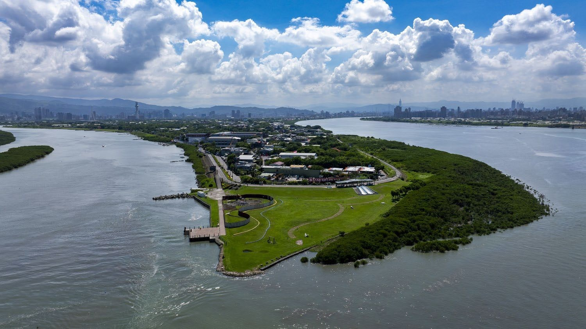

學員空拍作品：淡水河、基隆河口與社子島。從一百公尺高處看下去，地形自己會說話。

## 二、把學員的專業，當成課程的解碼器

這一班的組成極具多元性：有高中國文老師、補教事業的資深負責人、醫療背景的退休者、戶外運動達人，也有原住民與漢人學員並坐在同一張桌子前。備課時我沒有把這種異質性當成困擾，反而刻意把它設計成整門課的方法論。 人文與教育背景的學員擅長文本轉化。當我將《番俗六考》的記述、康熙臺灣輿圖的線條、日治時期遠藤寬哉《臺灣蕃地寫真帖》的攝影——這些材料本質上都是他者視角的凝視，充滿獵奇與分類的權力關係。工作坊學員有能力把它們重新拆解，還原成具有人文溫度的在地故事。 醫療與戶外背景的學員則從身體經驗切入。他們熟悉山川地理與步道空間，一旦把基隆河流域的錫口社、里族社、塔塔悠社，與北投地區的嗄嘮別社、北投社、麻少翁放到地形圖上，這些名詞立刻有了現場感——原來社址都挑在河灣的內側、水路交會的緩坡上，那是可以停船、可以取水、也能避開洪汛的位置。地名不再是考據名詞，而是一套關於怎麼活下去的空間智慧，理解認識先民生活樣貌線索，我們一層層發現文獻中蘊含的故事。 最珍貴的是原漢學員之間的對話。傳統的原住民研究裡，總有一條看不見的線，把人分成「被研究者」與「觀察者」。這門課裡那條線是失效的：漢人學員在講自己童年住過的舊街廓，原住民學員在講家族記憶裡的遷徙路線，兩邊都是敘述者，也都是聽眾。歷史討論因此回到了平等共構的主體位置。

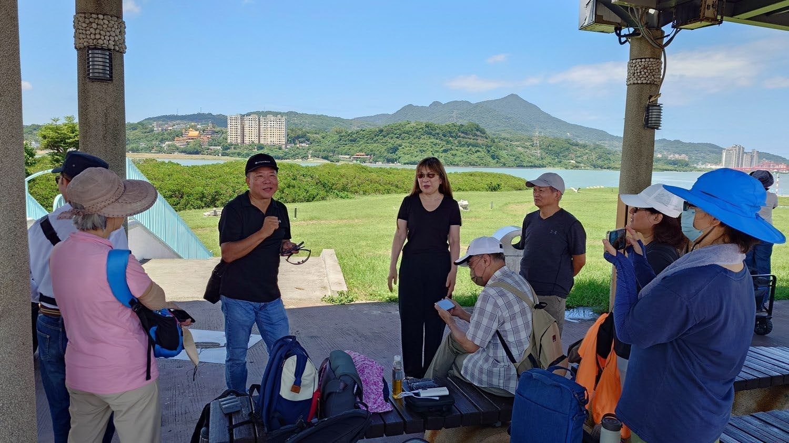

社子島頭現場走讀：在河濱涼亭裡對照古地圖與對岸地景，觀音山與淡水河就是最大的一張教材。

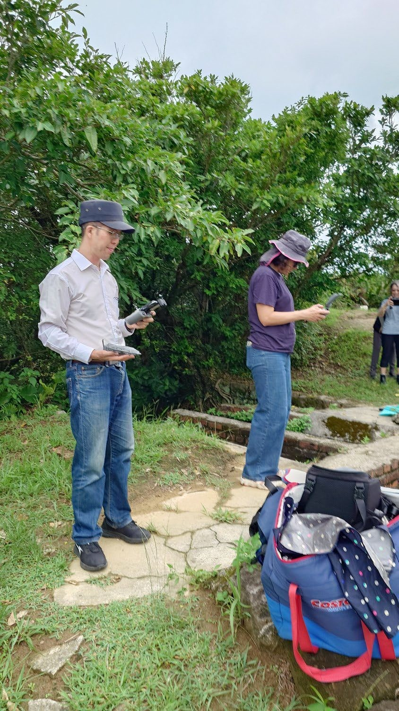

彼此賦能：操作經驗的橫向傳遞，往往比講師示範更快讓人進入狀況。學員在和平島社寮砲台空拍雞籠社

## 三、四段迴圈：文獻、走讀、空拍、創作

課程的骨架是一個可以反覆運轉的迴圈：文獻研讀、現場走讀、空拍紀錄、影音創作。四個階段不是線性的進度條，而是可以隨時折返的循環——走讀時發現的疑問，會把人重新推回文獻；空拍看到的地形，又會改寫走讀當天的判斷。 文獻研讀不從結論開始，而從矛盾開始。看著 1590 年代西班牙教會的馬尼拉手稿所繪製雞籠社人樣貌，我和學員都深感疑惑，凱達格蘭人真的長這樣嗎?怎麼捲毛和滿臉落腮鬍子；清代特使的紀錄、荷西與清領時期的人口調查，這些材料彼此打架——同一個社，名字有三種寫法，位置差了兩公里。刻意把這些不一致攤開來，因為那正是「消失」發生的現場：消失往往不是一次性的抹除，而是一次又一次的誤記、改寫與省略。

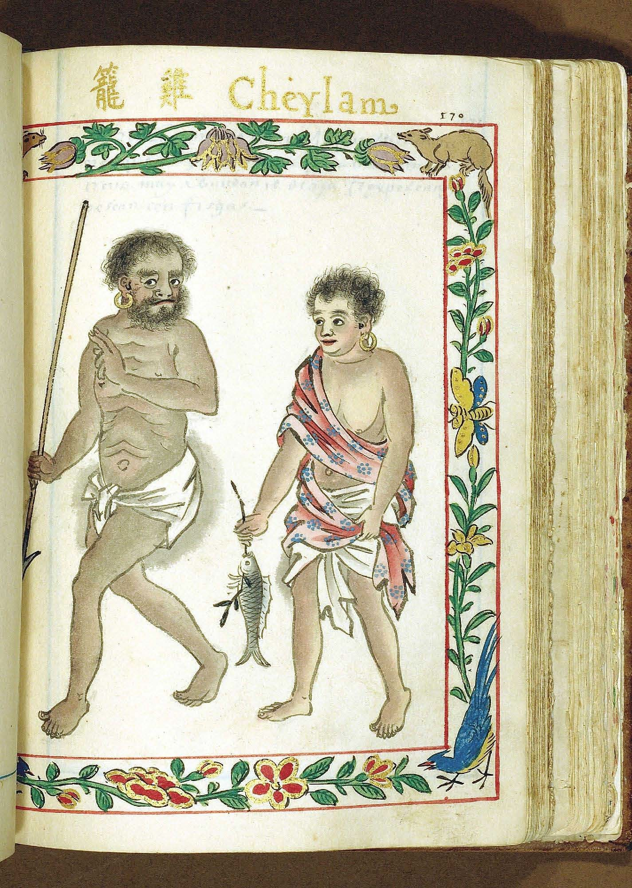

文獻閱讀探討：認真找資料有時反爾更增疑惑，珍貴馬尼拉手稿繪製雞籠社男女

現場走讀則是把矛盾帶到地面上求證。我們走訪社子、北投、淡水、八里、基隆和平島。站在社子島頭堤防上指著對岸說「那裡就是干豆門」，飛過去模擬從淡水划船進入台北湖視角，跟在教室裡看投影片，是完全不同的兩種認知經驗。有位學員在走讀那天說了一句話我記到現在：「我在這條路上騎了二十年腳踏車。」他不是不熟悉這裡，他是太熟悉了，熟悉到不再看見。

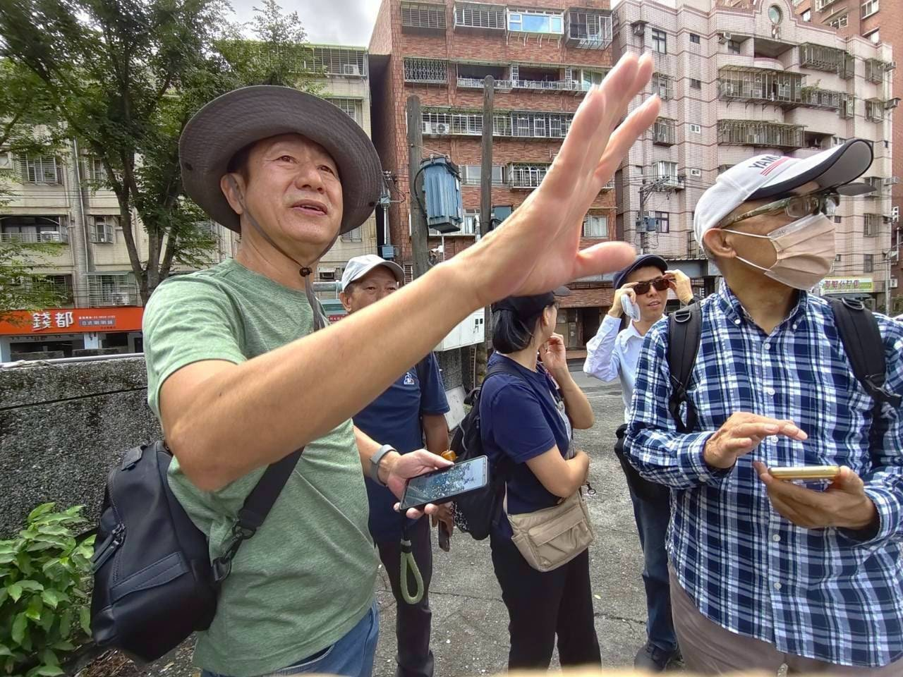

都市街廓裡的社址指認。走讀的難處不在於路遠，而在於眼前幾乎沒有任何遺跡可以指認。

我們也把十三行博物館與歷史現場納入課程場域。十三行的展櫃裡，專注看著鎮館之寶的人面陶罐，反覆思索藝術美感在凱達格蘭人生活中的可能，那些被復原的生活情境模型，在走讀之後看起來完全不一樣了，學員不再是觀眾，而是帶著問題來對照答案的人。同一組展件，第一次看是知識，第二次看是證據。

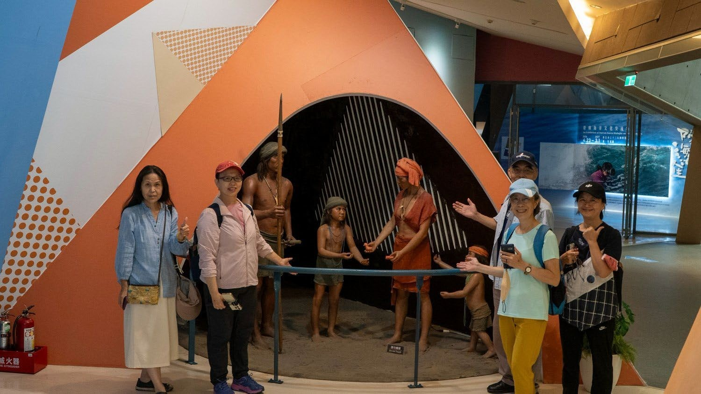

遺址博物館館研析：走讀之後再回到展場，學員看的不是展示，而是自己問題的答案。

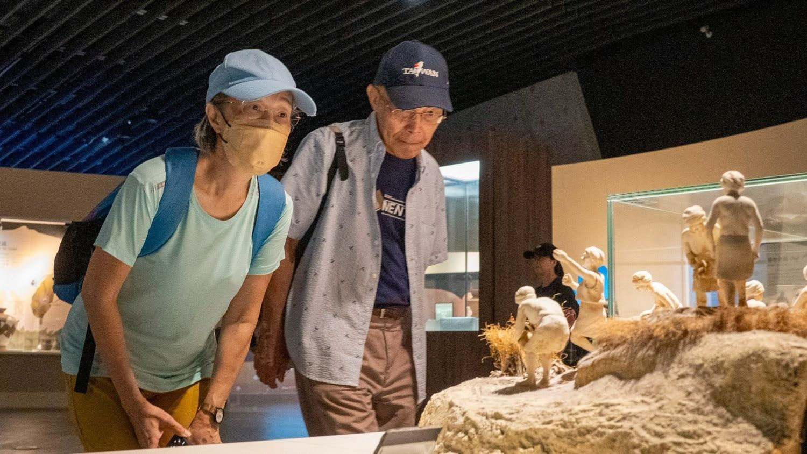

展件觀察：生活情境的復原模型，對照的是文獻裡讀到的漁獵與聚落型態。

## 四、無人機不是玩具，是三度空間視角還原過程

第三段是空拍。這門課用了無人機、攝影機與手機，也帶學員實際操作民航局遙控無人機管理資訊系統，做空拍場地的法規評估。這一段在設計時我特別小心，因為它最容易走偏成空拍教學——一旦變成講攝影、認識機型，課程的重心就會整個偏掉為影像設計課，而非探索先民故事。 課程的立場很清楚：空拍在這門課裡不是攝影技術，而是一種認識論工具。人站在地面上，視野被建築物切斷，只能看見街廓；升到一百公尺，地形自己會說話——河怎麼彎、台地怎麼降、聚落怎麼順著等高線長出來。那些在文獻裡讀到、看似隨機的社址位置，從空中看下去全部變得合理。空拍打破的不只是地貌的限制，更是古今疊合的可能：學員高坤燦把北投社河岸空拍鏡頭熔接(Mix)到 AI 生成的同一位置 400 年前河岸生活樣貌，這個設計展現了穿越時空，同一個畫面裡，河灣還是四百年前的河灣，橋與大樓卻是昨天才蓋好的。

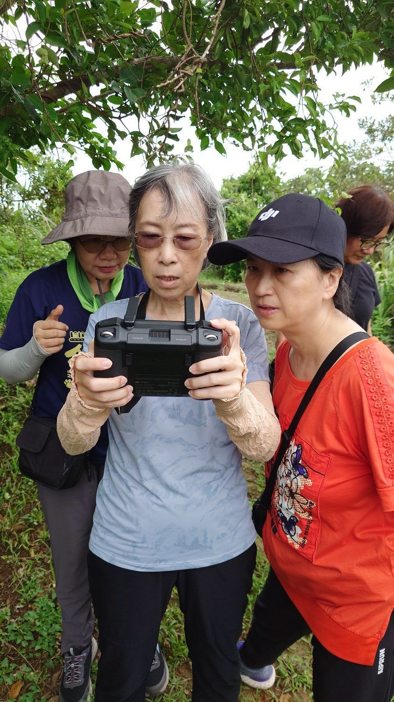

飛行操作：學員實際掌鏡，決定鏡頭停在哪一個河灣。

且把這件事稱為「視角的還原」。過去關於台北原住民的影像，幾乎都是由外來者拍攝、由外來者定義的——包括那些被反覆引用的日治時期寫真帖。當學員自己握住遙控器、自己決定要飛向哪一片水岸，那一刻拍攝權就轉移了。這不是修辭，是真實發生在操作層面上的觀看權力移轉還原。

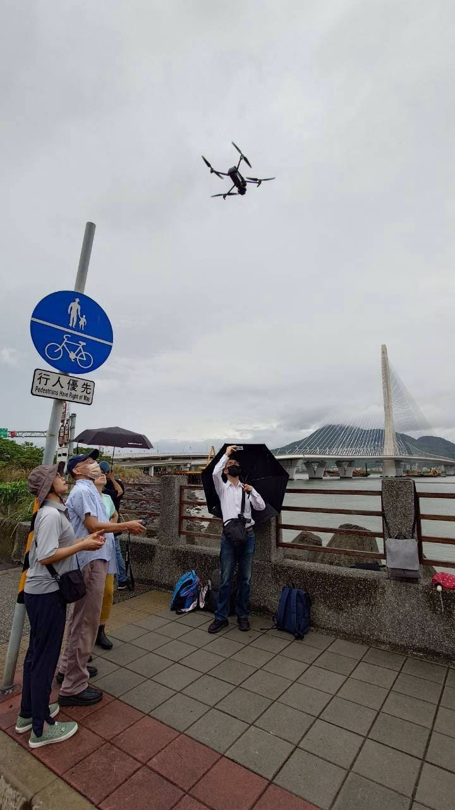

河濱起飛：淡江大橋旁的場地評估與航前檢查，紅區包圍三面，只能前飛出去，法規與天候都是課程的一部分。

年齡不是障礙。班上最年長的 43 年次學員，是帶領學員設計飛行路徑，建議動態鏡頭思維的前空拍證照班學員，他豐富了田野調查影像採集任務，讓大部分學員都能獨立完成一段段環繞鏡頭。科技的門檻常常被高估；課程要碰空拍，不能忽視安全，但不讓空拍成為門檻、擔憂，是「有沒有一件值得你飛的事」。這門課提供的，分組互助支援，降低風險，想清楚、會評估哪些值得取得的素材。

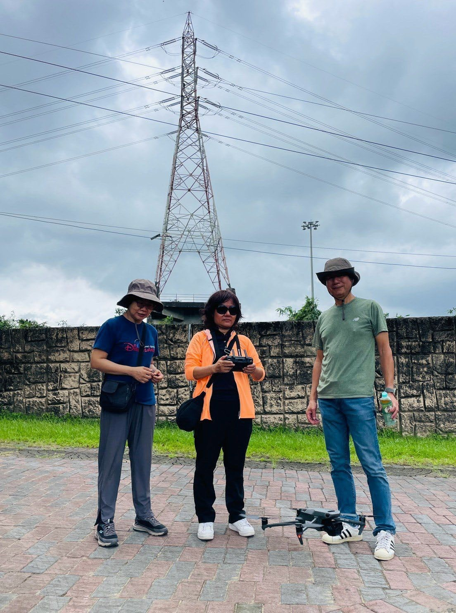

出勤紀錄：每一次飛行前後的裝備整備與空域確認。汐止峰仔峙社空拍創作

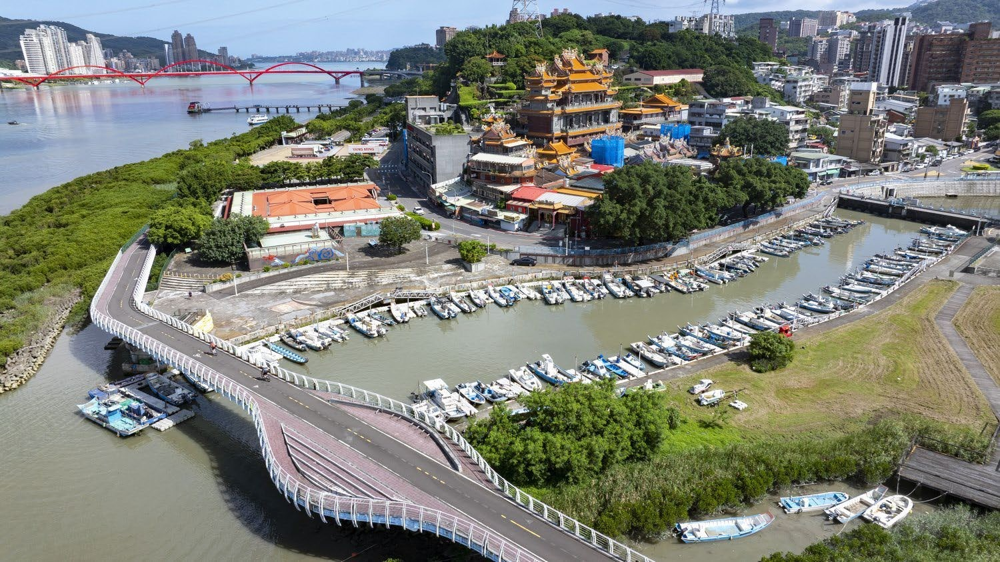

空拍成果：聚落、廟宇、漁港與水岸的疊層。地景本身就是一部未被書寫的地方史。

## 五、作品：知識共構的具體證據

最後一段是創作。學員把各自的專業與空拍影像接起來，產出的作品比我預期的更有在地洞察力。 高坤燦的《凱達格蘭族你在哪裏？》，用探索性的鏡頭穿梭於都市角落與古地名之間，透過空拍一路穿越回四百年前的北投干豆門，把現代人與消失的部落遺址拉進同一個畫面。Abby 的《空拍奇遇記》從課堂上聆聽故事的學生神遊出發，帶觀眾進入一個奇幻部落，AI 生成的技巧使用相當成熟獨特，讓古早的原民樣貌有了豐富神韻。江秀月的《台北的心》MV 結合影像與音樂敘事，橋段中的歌詞：閉上雙眼，聽風呼吸，那是 祖先 給的指引。把用心感受台北唱出來，重新詮釋承載原民歷史與土地呼吸的時空。 張穗芬的《探尋凱達格蘭族的遺跡》選擇搭捷運去找凱達格蘭，從文化資產與遺址的角度出發，她讓十三行博物館裡靜態的人物模型瞬間表情鮮活，卻又嚴肅地整理原民歷史在當代的殘留痕跡。黃文津的《凱達格蘭族的故事》則把博物館零碎的部分接了起來——傳說、同胞相婚的敘事類型、荷西與清領時期的人口調查，被整理成一條完整而具說服力的族群生命史。李麗玲 《尋找番仔埔：台北盆地的凱達格蘭土地記憶》  要尋南港社番仔埔的記憶。他說我們必須順著河流，回到台北盆地的起點。 六件作品，六種進入歷史的方法。作為課程設計者，最好的時刻大概就是看到從提案到成果，一步步探索發掘未曾注視的腳下。當課程搭好了一個結構，然後發現裡面長出來的東西，超出你原本的想像，很欣喜。

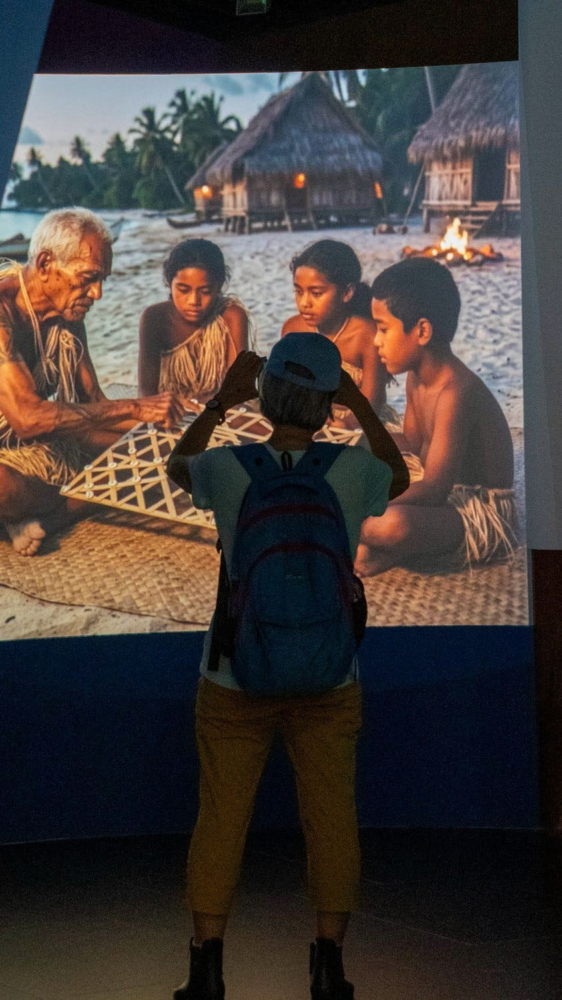

創作素材蒐集：展場中專業影像與情境再現畫面，吸引著我們深思，最後將在學員說故事時重新相遇。

## 六、寫在課程之後

這門工作坊讓我更確定一件事：「台北原住民故事」的開發，不應該只是學者的獨白，而是市民共同參與的在地知識建構過程。透過文獻研讀、現場走讀、空拍紀錄到影音創作的循環，不同專業的學員彼此賦能——漢人學員重新認識了腳下土地的深層歷史，原住民學員則找回了都會區裡消失的集體記憶。這種知識共構不只賦予國家文化記憶新的生命力，也為社區大學的在地文史探索提供了一種想像。 它同時回應了民族學苑的轉型命題。部落大學從一般終身學習課程，逐步深化為兼具文化傳承、專業學習與實作產出的學程架構；這門課或許剛好站在三者的交會點上；它有文化傳承的內容，有專業技術的門檻，也交得出看得見的成果。 社子島頭空拍那天，我們在涼亭前拍了大合照。當天有人推車帶大行動電源，有人帶二台無人機，飛完 360 飛空拍無人機。看著這張照片想，我們其實沒有找回任何一個消失的社，但課程確實讓學員感受到更鮮明凱達格蘭人生活樣貌，他們留在這座城市的印記，必將有更多凱達格蘭族故事被發掘出來。充滿想像力，或許就是知識共構這顆美麗果實的樣子。

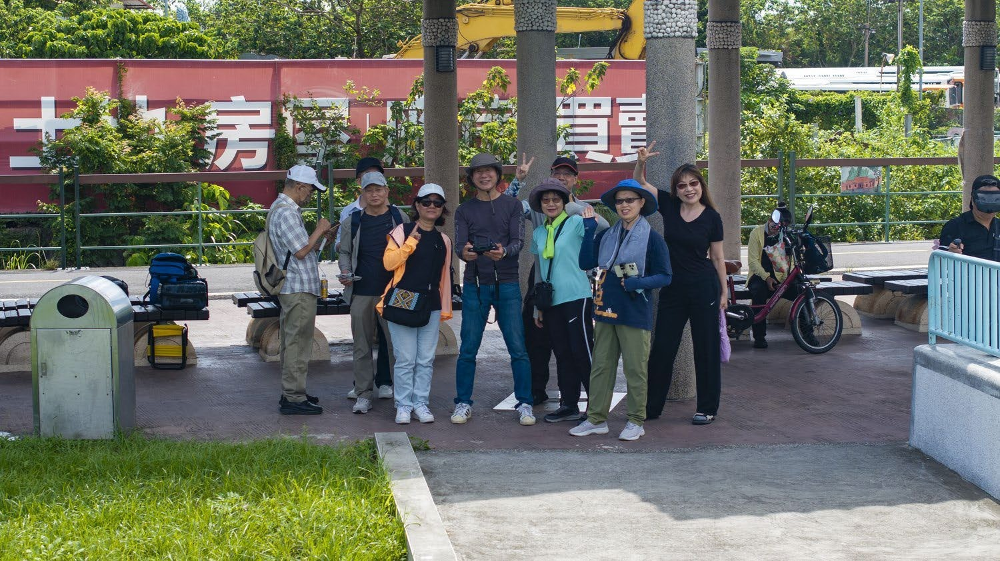

課程結束。沒有找回任何一個消失的社，但在這座城市的印記裡，多了幾部由市民親手標記的作品。
